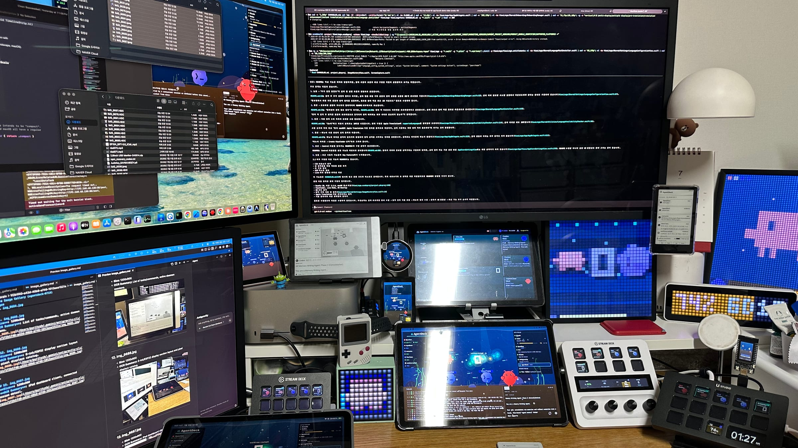
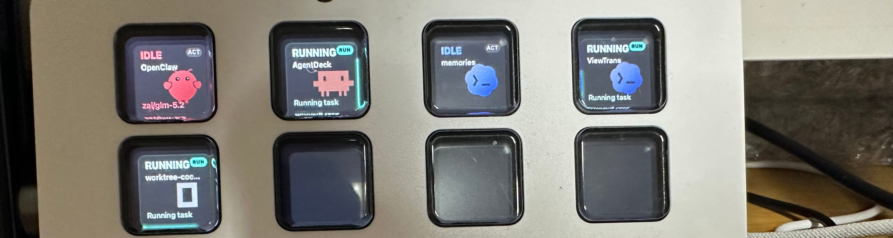
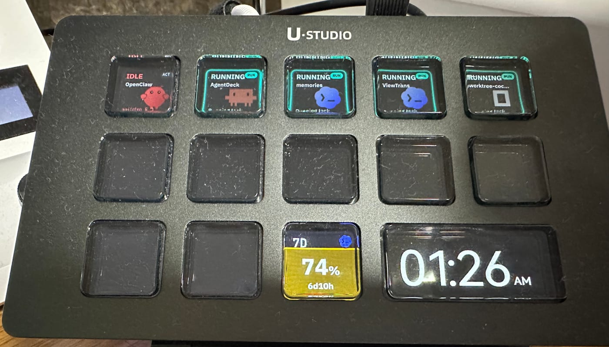
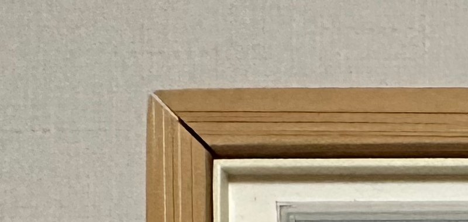
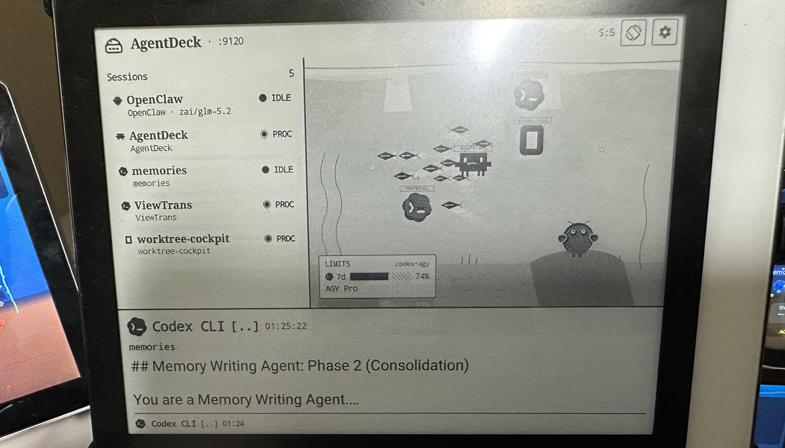
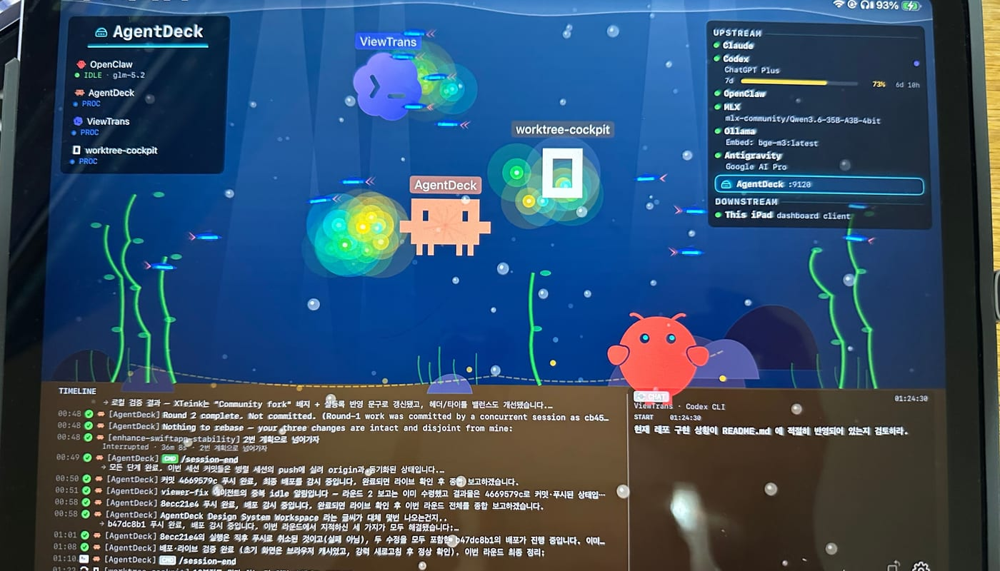
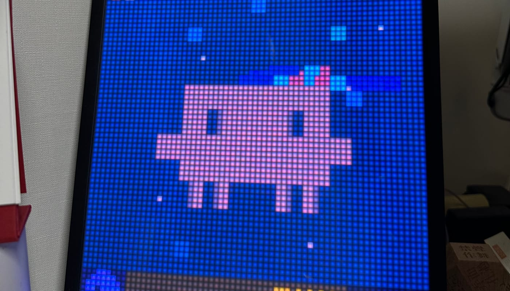

<p align="center">
  
</p>

# AgentDeck

<p align="center">
  <a href="https://apps.apple.com/app/id6784822497"></a>
  <a href="LICENSE"></a>
  <a href="https://www.npmjs.com/package/@agentdeck/setup"></a>
  <a href="https://github.com/puritysb/AgentDeck/actions/workflows/ci.yml"></a>
  <a href="https://puritysb.github.io/AgentDeck/"></a>
</p>

**Stop Chatting. Start Steering.**

AgentDeck puts your AI coding agents on a physical control surface. Every key is a
session: it shows which agent is running, in which project, and whether it is
working, waiting on you, or idle — and it repaints itself as that changes. Press a
key to jump in.

It started on an Elgato Stream Deck+ and now drives **22 surfaces** at once —
decks, tablets, e-ink readers, ESP32 panels, LED matrices, and your terminal.

<p align="center">
  
</p>

<p align="center">
  <a href="https://youtu.be/s-f8ICBcC4o"><strong>▶ Watch the demo</strong></a>
  &nbsp;·&nbsp;
  <a href="https://puritysb.github.io/AgentDeck/"><strong>🌊 Project website</strong></a>
  &nbsp;·&nbsp;
  <a href="https://puritysb.github.io/AgentDeck/hardware/">Devices</a>
  &nbsp;·&nbsp;
  <a href="https://puritysb.github.io/AgentDeck/demo/">Live preview</a>
  &nbsp;·&nbsp;
  <a href="https://puritysb.github.io/AgentDeck/design-system/">Design system</a>
</p>

---

## Start here

**You do not need a Stream Deck to try AgentDeck.** The daemon is the product; the
decks are one way to look at it. If you have a terminal, you can see it working in
about a minute.

### 1. Install

For the standalone native dashboard, [download AgentDeck Dashboard from the Mac App Store](https://apps.apple.com/app/id6784822497). It carries its own Swift daemon and needs no Node.js.

For the CLI, terminal dashboard, and PTY steering:

```bash
npx @agentdeck/setup
```

This installs the `agentdeck` CLI and the local daemon, and registers the lifecycle
hooks for whichever agent CLI you already have. Nothing else is required — the
Stream Deck app, Stream Deck hardware, and Xcode tools are checked and reported,
but never block the install.

**You need:** macOS 15+ (or Windows 11 — see [docs/windows.md](docs/windows.md)),
Node.js 22+, and at least one agent CLI (Claude Code, Codex, or OpenCode).

### 2. Look at it — no hardware required

```bash
agentdeck dashboard
```

A full terminal dashboard: your live sessions, a braille-rendered terrarium, usage
gauges, and the timeline. This is the zero-hardware way to see whether AgentDeck is
useful to you.

<p align="center">
  
</p>

### 3. Run a session

```bash
agentdeck claude      # or: agentdeck codex · agentdeck opencode
```

Your agent runs exactly as before — the bridge is transparent, and if it is off,
nothing changes. Already have an agent running in another terminal? The daemon
observes it through hooks; you do not have to launch it through AgentDeck.

### Then add surfaces

Any of these attach to the same daemon, and you can add them in any order:

| Surface | How to attach |
|---|---|
| **Stream Deck / Mini / Plus** | Install the plugin from the [Elgato Marketplace](https://marketplace.elgato.com/) *(in review)*, or `cd plugin && streamdeck link bound.serendipity.agentdeck.sdPlugin` from a checkout |
| **Ulanzi D200H** | Install the plugin in Ulanzi Studio — see [plugin-ulanzi/VERIFY.md](plugin-ulanzi/VERIFY.md) |
| **macOS app** | [Download on the Mac App Store](https://apps.apple.com/app/id6784822497) — the SwiftUI dashboard carries its own daemon, so it needs no Node.js. iPhone/iPad companion in review |
| **Android tablet / e-ink** | Signed APK from [Releases](https://github.com/puritysb/AgentDeck/releases) — see [docs/android.md](docs/android.md) |
| **ESP32 panels · InkDeck e-ink** | Flash firmware, then Wi-Fi OTA — see [docs/esp32.md](docs/esp32.md) |
| **Pixoo64 · TC001 · Timebox · iDotMatrix** | `agentdeck pixoo scan` / `agentdeck timebox scan` — see [docs/devices.md](docs/devices.md) |

> **The Stream Deck and Ulanzi plugins are thin clients.** They talk to the
> AgentDeck daemon the way an OBS plugin talks to OBS, and never embed it. With no
> daemon running they show an OFFLINE state pointing at the install command.

Full build-from-source and manual steps: **[docs/install.md](docs/install.md)**.

---

## What it looks like on real hardware

<table>
<tr>
<td width="50%"></td>
<td width="50%"></td>
</tr>
<tr>
<td><b>Stream Deck+</b> — one key per session, plus encoders for volume, quota, and launch</td>
<td><b>Ulanzi D200H</b> — 14 keys and a 960×540 LCD, driven by the official Ulanzi Studio plugin</td>
</tr>
<tr>
<td></td>
<td></td>
</tr>
<tr>
<td><b>InkDeck e-ink</b> — 7.5" 800×480, custom firmware, updates over Wi-Fi OTA</td>
<td><b>Android e-ink</b> — reader-specific layouts with partial refresh</td>
</tr>
<tr>
<td></td>
<td></td>
</tr>
<tr>
<td><b>Apple</b> — SwiftUI on macOS, iPhone, and iPad</td>
<td><b>Pixoo64</b> — 64×64 pixel-art terrarium and usage HUD</td>
</tr>
</table>

<p align="center">
  <strong><a href="https://puritysb.github.io/AgentDeck/hardware/">→ Browse all 22 surfaces, with live renderer previews</a></strong>
</p>

---

## What it does

- **Session per key** — agent, project, and state on every key, repainting live
- **Distinct attention state** — see at a glance which agent is waiting on *you*
- **Answer without switching windows** — YES / NO / ALWAYS with semantic colors
- **Interrupt** — STOP sends Ctrl+C to a runaway agent
- **Switch modes** — cycle Plan / Accept Edits / Default
- **Quick actions** — GO ON / REVIEW / COMMIT / CLEAR, plus custom prompt templates
- **Usage gauges** — subscription quota with reset countdowns
- **Voice** — push-to-talk and wake word, on-device via Apple SFSpeech, no model download
- **Display sync** — host sleep dims every surface; wake restores them

### Agents

| Agent | Status |
|---|---|
| **Claude Code** | Supported (primary) |
| **Codex CLI** | Supported |
| **OpenCode** | Supported |
| **OpenClaw** | Experimental |

State comes from agent-native lifecycle and event channels — hooks for Claude Code
and Codex, OpenCode SSE, and the OpenClaw Gateway — rather than terminal-screen
scraping. PTY parsing remains a best-effort assist for CLI-managed sessions.

### How it fits together

```
                              ┌── Daemon (port 9120, sole hub) ──┐
Stream Deck Plugin ◄── WS ──►│                                   │
D200H via Studio  ◄── WS ──►│                                   │
Android Dashboard  ◄── WS ──►│  WS Server + mDNS + Device Mods   │
Apple Dashboard    ◄── WS ──►│  Gateway Proxy + Usage Relay      │
TUI Dashboard      ◄── WS ──►│  Pixoo + ESP32 + Timebox + SSE    │
ESP32 Display      ◄ Serial ►│                                   │
Pixoo64 LED        ◄ HTTP ──►└───────────────┬───────────────────┘
                                             │ aggregates
                              ┌── Session Bridge (port 9121+) ──┐
User's Terminal ◄─ stdio ───►│  PTY Manager → agent CLI          │
Agent Hooks     ─── HTTP ───►│  Hook Server → State Machine      │
                              └──────────────────────────────────┘
```

One daemon aggregates every session and broadcasts to every surface. Interactive
surfaces (Stream Deck, D200H, Android, Apple) can steer when a PTY-managed session
supplies real options; observed sessions remain display-only. On macOS the SwiftUI
app ships a **standalone in-process Swift dashboard daemon** with no Node.js. The
PTY Session Bridge remains a CLI feature.

Details: **[docs/architecture.md](docs/architecture.md)**.

---

## Documentation

**Start with the website** — [puritysb.github.io/AgentDeck](https://puritysb.github.io/AgentDeck/)
carries the rendered device catalog, live renderer previews, the design system, and
build health.

| | |
|---|---|
| **Using it** | [CLI reference](docs/cli.md) · [Configuration](docs/configuration.md) · [Troubleshooting](docs/troubleshooting.md) · [Windows](docs/windows.md) |
| **Surfaces** | [Hardware matrix](docs/hardware-compatibility.md) · [Stream Deck layout](docs/streamdeck-layout.md) · [Devices](docs/devices.md) · [ESP32](docs/esp32.md) · [Android](docs/android.md) · [Apple](docs/apple-app.md) · [TUI](docs/tui-dashboard.md) |
| **Internals** | [Architecture](docs/architecture.md) · [Daemon](docs/daemon.md) · [Protocol](docs/protocol.md) · [Gateway protocol](docs/gateway-protocol.md) · [Testing](docs/testing.md) |
| **Evaluation** | [Why APME](docs/why-apme.md) · [APME](docs/apme.md) · [Pipeline](docs/apme-pipeline.md) |
| **Design** | [DESIGN.md](DESIGN.md) · [Tokens](design/tokens.css) · [Resource map](design/RESOURCES.md) |
| **Project** | [Roadmap](docs/roadmap.md) · [Releasing](RELEASING.md) · [Changelog](CHANGELOG.md) · [Agent harness](docs/agent-harness.md) |

---

## Releases

One `major.minor` compatibility line across every artifact; target patches and
delivery tags advance independently. Root [`VERSION`](VERSION) is the source-train ceiling — policy in [RELEASING.md](RELEASING.md),
builds on [Releases](https://github.com/puritysb/AgentDeck/releases).

| Channel | Tag | Status |
|---|---|---|
| **npm** — `@agentdeck/setup` | `npm-v*` | [1.0.2](https://github.com/puritysb/AgentDeck/releases/tag/npm-v1.0.2) |
| **Apple App Store** — macOS | `apple-v*` | [1.0.0 live](https://apps.apple.com/app/id6784822497); 1.0.2 update prepared (iOS companion in review) |
| **Elgato Marketplace** — Stream Deck plugin | `streamdeck-v*` | [1.0.2 release](https://github.com/puritysb/AgentDeck/releases/tag/streamdeck-v1.0.2); Maker upload pending |
| **Ulanzi Marketplace** — D200H plugin | `ulanzi-v*` | [1.0.1 release](https://github.com/puritysb/AgentDeck/releases/tag/ulanzi-v1.0.1); support handoff pending ([details](marketplace/ulanzi/LISTING.md)) |
| **GitHub Release** — Android APK | `android-v*` | [1.0.2](https://github.com/puritysb/AgentDeck/releases/tag/android-v1.0.2) |
| **GitHub Release** — ESP32 firmware | `esp32-v*` | [1.0.1](https://github.com/puritysb/AgentDeck/releases/tag/esp32-v1.0.1) |
| **Google Play** — Android AAB | `android-v*` | CI wired, gated on Play Console setup |

---

## Development

```bash
pnpm install && pnpm build     # shared must build before bridge/plugin
pnpm -r --parallel dev         # watch mode
pnpm test                      # Vitest (bridge, plugin, shared, hooks)
pnpm test:report               # unified: Vitest + Android + Apple + Robot
```

Four test frameworks cover the tree — Vitest for the Node/TS packages, JUnit +
Robolectric for Android, XCTest for Apple, and Robot Framework for ESP32 hardware.
Only Vitest runs in default CI; the rest go through `scripts/test-report.sh`. Current
results are published at [/reports/](https://puritysb.github.io/AgentDeck/reports/).

Working on AgentDeck with a coding agent? Start at **[CLAUDE.md](CLAUDE.md)** and
**[docs/agent-harness.md](docs/agent-harness.md)** — they map how each agent enters
the repo and which skills it should use.

Full guide: **[docs/testing.md](docs/testing.md)** · Build from source:
**[docs/install.md](docs/install.md)**.

---

## License & attribution

MIT — see [LICENSE](LICENSE).

Independent project. Not affiliated with Anthropic, OpenAI, Google, Elgato, DIVOOM,
or any other third party referenced here. All trademarks belong to their respective
owners. Full notices in [ATTRIBUTION.md](ATTRIBUTION.md).
