<p align="center">
  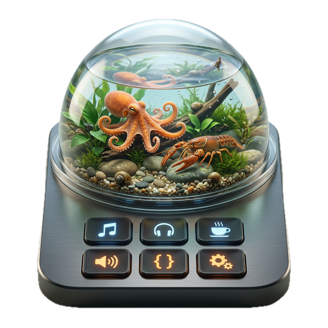
</p>

# AgentDeck

<p align="center">
  <a href="LICENSE"></a>
  <a href="https://www.npmjs.com/package/@agentdeck/setup"></a>
  <a href="https://github.com/puritysb/AgentDeck/actions/workflows/ci.yml"></a>
  
</p>

<p align="center">
  
  = 22">
  
  
  
  
  
  
</p>

**Stop Chatting. Start Steering.**

AgentDeck is a physical control surface for AI coding agents. It started with an Elgato Stream Deck+ and now runs on **12 display surfaces simultaneously** — tablets, e-ink readers, phones, ESP32 modules, LED matrices, and terminals.

> One bridge. 12 surfaces. Steer your AI — without leaving your keyboard flow.

<p align="center">
  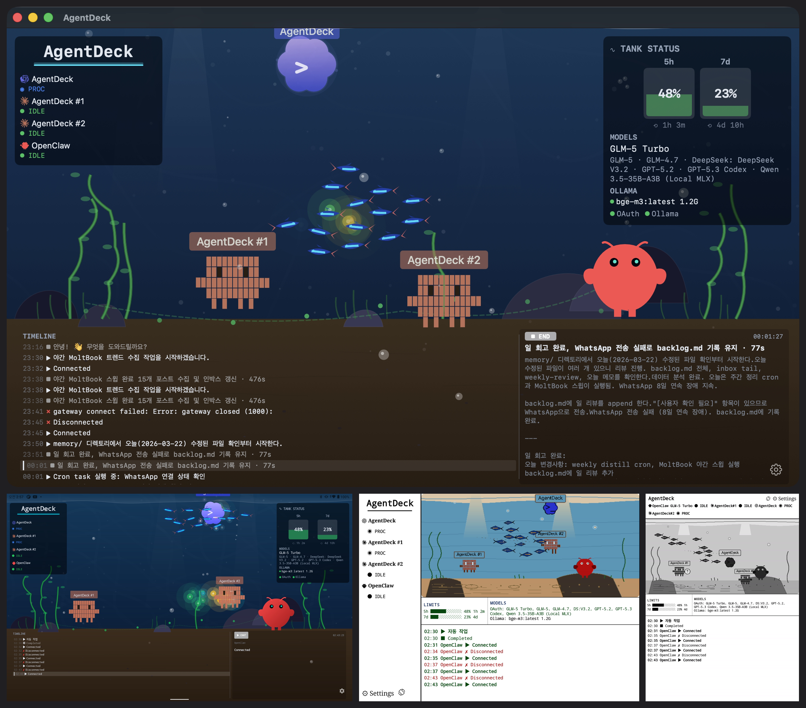
</p>

<p align="center">
  <a href="https://youtu.be/s-f8ICBcC4o"><strong>Watch Demo on YouTube</strong></a>
</p>

<p align="center">
  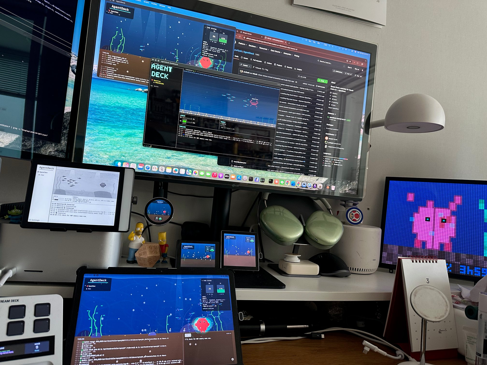
</p>

| | Requirement |
|---|---|
| **Platform** | macOS 14+ (Sonoma) — Windows/Linux not supported |
| **Hardware** | Elgato Stream Deck+ (8 keys, 4 encoders, LCD touch strip) |
| **Terminal** | iTerm2 (required for session management and voice paste) |
| **Android** | *(Optional)* Android 10+ tablet or e-ink reader for remote dashboard |
| **Apple** | *(Optional)* iOS 17+ / iPadOS 17+ / macOS 14+ for SwiftUI dashboard |
| **TUI** | *(Optional)* Any terminal with truecolor support for `agentdeck dashboard` |

---

## Table of Contents

- [What is AgentDeck?](#what-is-agentdeck)
- [Prerequisites](#prerequisites)
- [Quick Start](#quick-start)
- [Manual Build & Install](#manual-build--install)
- [Usage](#usage)
  - [CLI Reference](#cli-reference)
- [Stream Deck+ Layout (v3)](#stream-deck-layout-v3)
- [Android Dashboard](#android-dashboard)
- [Apple Dashboard](#apple-dashboard)
- [TUI Dashboard](#tui-dashboard)
- [ESP32 Display](#esp32-display)
- [Pixoo64 LED Matrix](#pixoo64-led-matrix)
- [Configuration](#configuration)
- [Troubleshooting](#troubleshooting)
- [Uninstall](#uninstall)
- [Development](#development)
- [Roadmap](#roadmap)

### Documentation

- [Voice Setup](docs/voice-setup.md) — sox, whisper.cpp install, model selection
- [Wake Word Detection](docs/wake-word.md) — Porcupine (Mac) + microWakeWord (ESP32) setup
- [Stream Deck+ Layout Reference](docs/streamdeck-layout.md) — per-state layouts, encoder details, button colors
- [Android Reference](docs/android.md) — device support, build/signing, creature behavior
- [Device Reference](docs/devices.md) — 7 dashboard device types, transport protocols, broadcast architecture
- [Protocol & Architecture](docs/protocol.md) — state machine, WebSocket messages, project structure
- [Testing Guide](docs/testing.md) — test structure, coverage, CI pipeline, writing tests

---

## What is AgentDeck?

A **control surface** — like an audio mixing console, but for AI coding agents. It reads your agent's state in real-time and dynamically reconfigures buttons and encoders to match what's happening right now.

- **Respond instantly** — YES / NO / ALWAYS buttons appear with semantic colors for permission prompts
- **Interrupt** — STOP button sends Ctrl+C to a runaway agent
- **Switch modes** — cycle Plan / Accept Edits / Default
- **Navigate options** — encoder scrolls and selects multi-choice prompts on a wide-canvas LCD
- **Voice input** — push-to-talk → whisper.cpp → auto-send (offline, <2s on M-series)
- **Voice assistant** — wake word detection → whisper.cpp STT → LLM → TTS response (fully offline)
- **Display sync** — macOS sleep dims all connected surfaces; wake restores instantly
- **Terminal postit** — agent state shown in iTerm2 tab titles and badges
- **Monitor usage** — animated water-gauge dashboard with rate limit countdowns
- **Quick actions** — GO ON / REVIEW / COMMIT / CLEAR; encoder cycles custom prompts
- **System utilities** — volume, mic, media, timer from the Utility encoder
- **Terminal sessions** — iTerm dial switches sessions, auto-attaches tmux
- **Multiple coding agents** — Claude Code, Codex CLI, and OpenClaw in one multi-agent daemon view
- **Works from anywhere** — all 12 surfaces can monitor the agent; interactive surfaces (Stream Deck, Android, Apple) can also control it

The bridge is transparent: if it's off, Claude Code works exactly as before.

### Supported Agents

| Agent | Status |
|-------|--------|
| **Claude Code** | Supported (primary) |
| **Codex CLI** | Supported — PTY parser, model detection, and dashboard integration |
| **OpenClaw** | Experimental — Gateway WebSocket, timeline panel, log stream |

### Supported Surfaces — 12 Types

| # | Surface | Description |
|---|---------|-------------|
| 1 | **Stream Deck+** | Primary — 8 keys, 4 encoders, LCD touch strip |
| 2 | **Android Tablet** | Color terrarium + HUD overlay (60fps) |
| 3 | **E-ink Reader** | B&W 16-level grayscale + **Color E-ink** (Kaleido 3, 4096 colors) + partial refresh |
| 4 | **iPhone** | SwiftUI app — mobile agent monitoring |
| 5 | **iPad** | SwiftUI app — terrarium second screen |
| 6 | **macOS** | SwiftUI app — desktop monitoring window |
| 7 | **ESP32 Round AMOLED** | 1.8" circular 360×360 — compact WiFi display |
| 8 | **ESP32 IPS LCD** | 3.5" rectangular 480×320 |
| 9 | **ESP32 B86 Box** | 4" wall-mount touch panel 480×480 |
| 10 | **Ulanzi TC001** | 8×32 RGB LED matrix — compact HUD pages and creature sprites |
| 11 | **Pixoo64 LED** | 64×64 RGB LED pixel art terrarium |
| 12 | **TUI Terminal** | Unicode braille terrarium + ANSI dashboard — SSH/remote |

<p align="center">
  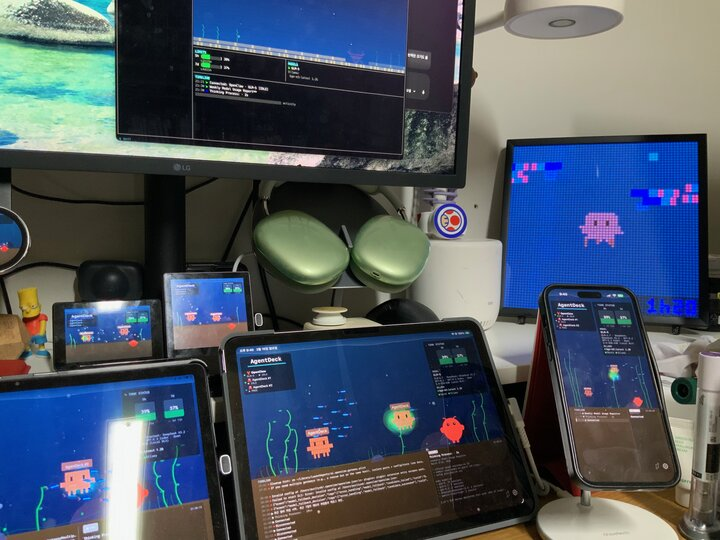
  &nbsp;&nbsp;
  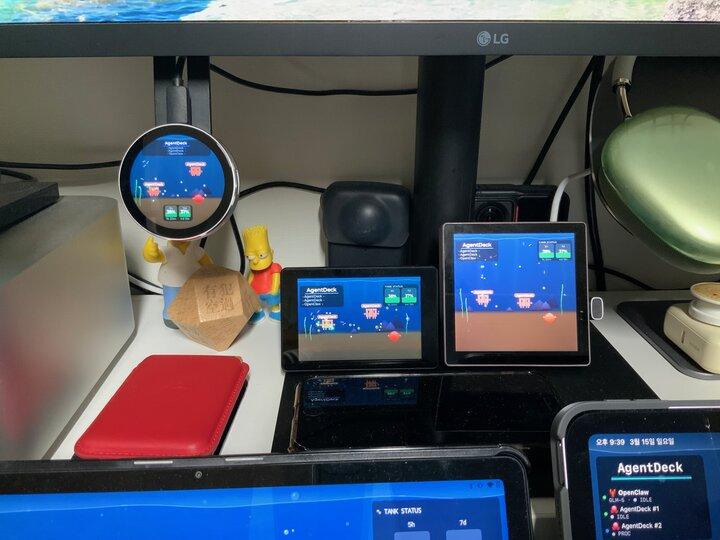
</p>
<p align="center"><em>Left: iPad + iPhone (SwiftUI) &nbsp;|&nbsp; Right: ESP32 3 types + Pixoo64 LED</em></p>

<p align="center">
  
  &nbsp;&nbsp;
  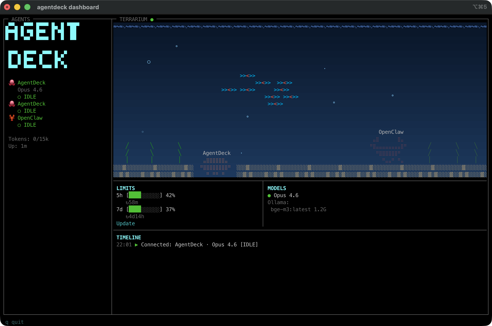
</p>
<p align="center"><em>Left: Dual E-ink — B&W (Crema S) + Color (Pantone 6) + ESP32 AMOLED &nbsp;|&nbsp; Right: TUI terminal dashboard</em></p>

### Architecture

```
                              ┌── Daemon (port 9120, sole hub) ──┐
Stream Deck Plugin ◄── WS ──►│                                   │
Android Dashboard  ◄── WS ──►│  WS Server + mDNS + Device Mods  │
Apple Dashboard    ◄── WS ──►│  Gateway Proxy + Usage Relay      │
TUI Dashboard      ◄── WS ──►│  Pixoo + ESP32 Serial + SSE      │
ESP32 Display      ◄ Serial ►│                                   │
Pixoo64 LED        ◄ HTTP ──►└───────────────┬───────────────────┘
                                             │ aggregates
                              ┌── Session Bridge (port 9121+) ──┐
User's Terminal ◄─ stdio ───►│  PTY Manager → claude CLI         │
Claude Code Hooks ─ HTTP ───►│  Output Parser → State Machine    │
                              │  Hook Server + Voice (whisper)    │
                              └──────────────────────────────────┘
```

The daemon is the sole hub for all dashboard clients. Session bridges handle PTY + hooks only. The daemon aggregates state from all sessions and broadcasts to all 12 surfaces. Local clients are auto-trusted; LAN clients authenticate with a token from `~/.agentdeck/auth-token`. Interactive surfaces (Stream Deck, Android, Apple) can control the agent; monitoring surfaces (Pixoo, TUI, ESP32) display state.

---

## Prerequisites

| Item | Required | Install |
|------|----------|---------|
| **macOS 14+** (Sonoma) | Yes | Windows/Linux not supported |
| **Xcode Command Line Tools** | Yes | `xcode-select --install` (node-pty native build) |
| **Node.js** >= 22 | Yes | `brew install node` |
| **pnpm** >= 9 | Yes | `npm install -g pnpm` |
| **Python 3** | Yes | `brew install python` (display sleep detection) |
| **Elgato Stream Deck app** >= 6.7 | Yes | [Elgato Downloads](https://www.elgato.com/downloads) |
| **Stream Deck+ hardware** | Yes | 8 keys + 4 encoders + LCD touch strip |
| **iTerm2** | Yes | Terminal management, voice paste, session switching |
| **Claude Code CLI** | Yes | `npm install -g @anthropic-ai/claude-code` |
| **JDK 17+** | For Android | `brew install openjdk@17` |
| **Stream Deck CLI** | Auto | Installed by `pnpm setup` if missing |
| **sox** (audio capture) | For voice | See [Voice Setup](docs/voice-setup.md) |
| **whisper.cpp** (transcription) | For voice | See [Voice Setup](docs/voice-setup.md) |

---

## Quick Start

```bash
# Option A: npm install (no clone needed)
npx @agentdeck/setup

# Option B: from source
git clone https://github.com/puritysb/AgentDeck.git && cd AgentDeck && pnpm setup
```

The `pnpm setup` command:
1. Checks required dependencies (Node.js 22+, pnpm, Claude CLI, Stream Deck app)
2. Installs `@elgato/cli` if missing
3. Runs `pnpm install` + `pnpm build`
4. Generates icon assets (16 PNGs)
5. Installs Claude Code hooks
6. Links the Stream Deck plugin
7. Links the `agentdeck` CLI globally
8. Checks optional dependencies (sox, whisper.cpp)

After setup, **restart the Stream Deck app**, then run:

```bash
agentdeck claude
```

You're steering.

---

## Manual Build & Install

### Build

```bash
cd AgentDeck
pnpm install
pnpm build            # shared → bridge, plugin, hooks
pnpm generate-icons   # SVG → PNG (required on first build)
```

### 1. Install Claude Code Hooks

```bash
node hooks/dist/install.js
```

Registers 7 hooks in `~/.claude/settings.local.json`: `SessionStart`, `SessionEnd`, `PreToolUse`, `PostToolUse`, `Stop`, `Notification`, `UserPromptSubmit`. Each hook POSTs JSON to the bridge. Remove with `node hooks/dist/install.js uninstall`.

### 2. Link Stream Deck Plugin

```bash
cd plugin && streamdeck link .sdPlugin
```

Creates a symlink in `~/Library/Application Support/com.elgato.StreamDeck/Plugins/`. **Restart the Stream Deck app** to load.

### 3. Link `agentdeck` CLI

```bash
cd bridge && pnpm link --global
```

### 4. Voice Setup (Optional)

Voice input requires **sox** (audio capture) and **whisper.cpp** (local transcription). Apple Silicon users must use arm64 Homebrew (`/opt/homebrew/`) for Metal GPU acceleration.

See **[Voice Setup Guide](docs/voice-setup.md)** for full instructions including architecture verification, model selection, and troubleshooting.

---

## Usage

### Start

```bash
agentdeck claude   # or: agentdeck codex
```

This spawns Claude Code or Codex CLI inside a PTY and starts a session bridge on a dynamic port (HTTP + hooks). Your terminal works exactly as before — the Stream Deck adds a parallel control channel. The **daemon** (port 9120, `0.0.0.0`) aggregates all sessions for external clients.

> **Security:** The daemon binds to `0.0.0.0` for LAN access (multi-surface monitoring). Local connections bypass authentication. Remote connections require the auth token from `~/.agentdeck/auth-token`.

### CLI Reference

The CLI command is `agentdeck`.

#### Sessions

| Command | Description |
|---------|-------------|
| `agentdeck claude` | Start Claude Code session (PTY + bridge) |
| `agentdeck codex` | Start Codex CLI session (PTY + bridge) |
| `agentdeck monitor` | Hook-only bridge (no PTY — run `claude` separately) |

**Flags:** `-p <port>`, `-c <command>`, `-d` (debug), `--no-update-check`
**Module flags:** `--local` (all off), `--no-mdns`, `--no-adb`, `--no-serial`, `--no-pixoo`

#### Daemon

| Command | Description |
|---------|-------------|
| `agentdeck daemon start` | Start monitoring daemon |
| `agentdeck daemon stop` | Stop daemon |
| `agentdeck daemon restart` | Restart daemon |
| `agentdeck daemon status` | Show daemon status |
| `agentdeck daemon install` | Register macOS LaunchAgent (auto-start) |
| `agentdeck daemon uninstall` | Remove LaunchAgent |

#### Session Management

| Command | Description |
|---------|-------------|
| `agentdeck status` | All sessions + daemon status |
| `agentdeck stop` | Stop a session (`-a` for all, `-p` for specific port) |

#### Monitoring

| Command | Description |
|---------|-------------|
| `agentdeck dashboard` | TUI monitoring dashboard (alias: `dash`) |
| `agentdeck devices` | Connected devices (WS, ESP32, Pixoo, ADB) |
| `agentdeck qr` | Pairing QR code + URL |
| `agentdeck diag` | Diagnostic dump (`-a` for AI analysis) |

#### Device Setup

| Command | Description |
|---------|-------------|
| `agentdeck pixoo scan` | Discover Pixoo devices on LAN |
| `agentdeck pixoo add <ip>` | Add a Pixoo device |
| `agentdeck pixoo list` | List configured devices |
| `agentdeck pixoo remove <ip>` | Remove a device |
| `agentdeck pixoo test [ip]` | Send test pattern |
| `agentdeck wifi-setup` | ESP32 WiFi provisioning (serial) |

---

## Stream Deck+ Layout (v3)

<p align="center">
  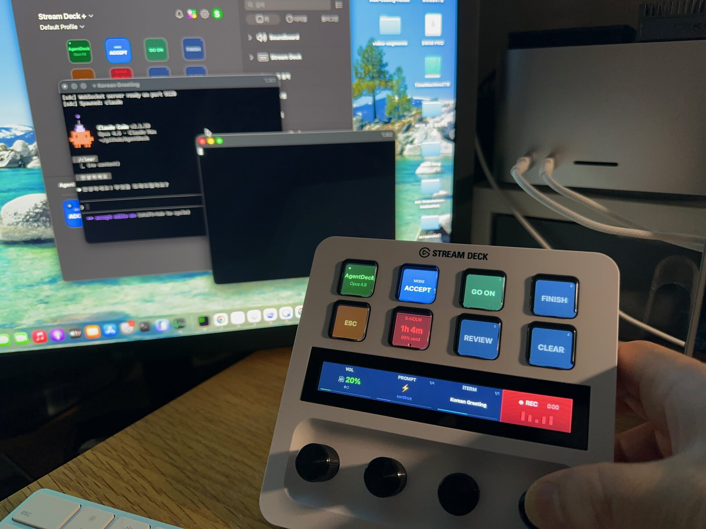
</p>

### Keypad — 8 Actions

```
┌────────┬─────────┬─────────┬───────────┐
│  MODE  │ SESSION │  USAGE  │  GO ON    │
├────────┼─────────┼─────────┼───────────┤
│ REVIEW │ COMMIT  │  CLEAR  │   STOP    │
└────────┴─────────┴─────────┘───────────┘
```

| Slot | Action | Description |
|------|--------|-------------|
| 0 | **Mode** | Toggle Default / Plan / Accept Edits |
| 1 | **Session** | Project name + state + session switch |
| 2 | **Usage** | Usage dashboard (5h / 7d / extra / session / models / oc-usage pages) |
| 3-6 | **Quick Action x4** | GO ON / REVIEW / COMMIT / CLEAR when idle — up to 4 options on permission/select prompt. 5+ options → 3 + MORE |
| 7 | **Stop** | Interrupt (Ctrl+C when processing) / Escape (when idle) |

### Encoders — 4 Slots

| Encoder | Action | Rotate | Push | Touch |
|---------|--------|--------|------|-------|
| E1 | **Utility** | Adjust value (volume, mic, timer) | Toggle / Action | Switch mode |
| E2 | **Action** | Scroll options / cycle prompts | Send prompt / Confirm | Same as push |
| E3 | **Terminal** | Switch iTerm session | Activate / Attach tmux | — |
| E4 | **Voice** | Scroll transcription text | Hold = record, tap (<500ms) = cancel | — |

<p align="center">
  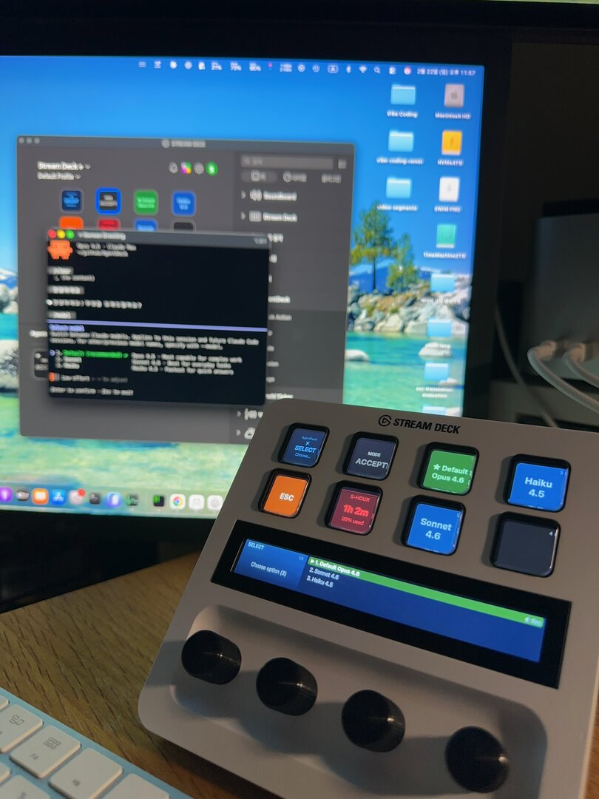
  &nbsp;&nbsp;
  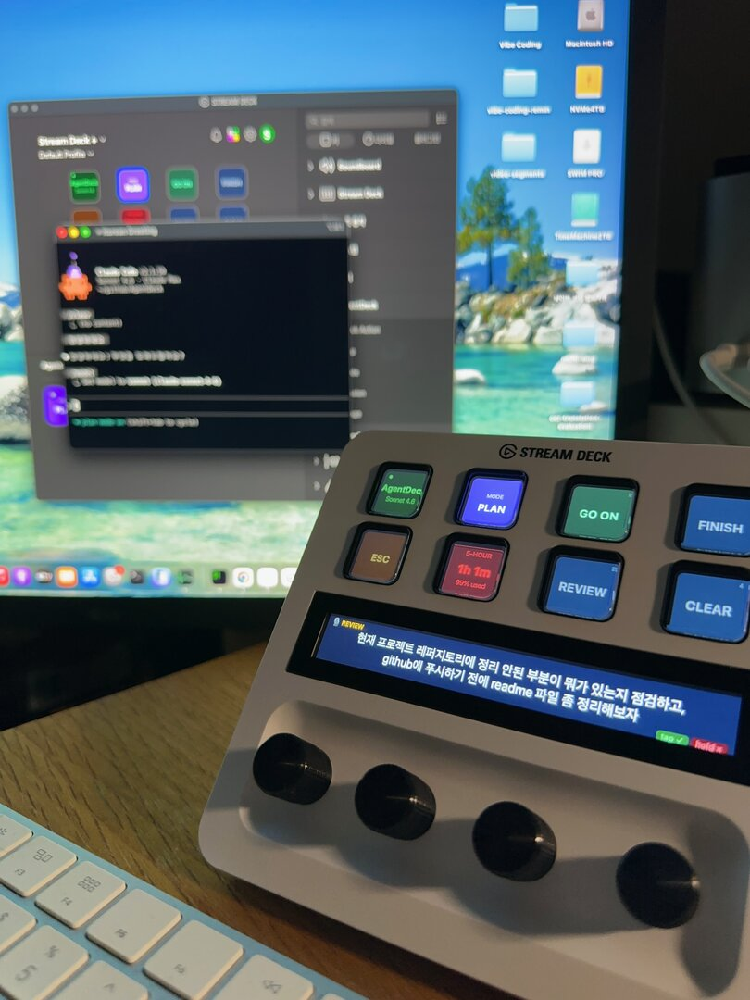
</p>
<p align="center"><em>Left: Voice transcription (Korean) on wide-canvas LCD &nbsp;|&nbsp; Right: Model selection with encoder option list</em></p>

### Dynamic Button States

Slots 3-6 reconfigure based on agent state — permission prompts get semantic colors (green=approve, red=deny, blue=permanent), options get teal/green, and 5+ options collapse into encoder wide-canvas mode.

<p align="center">
  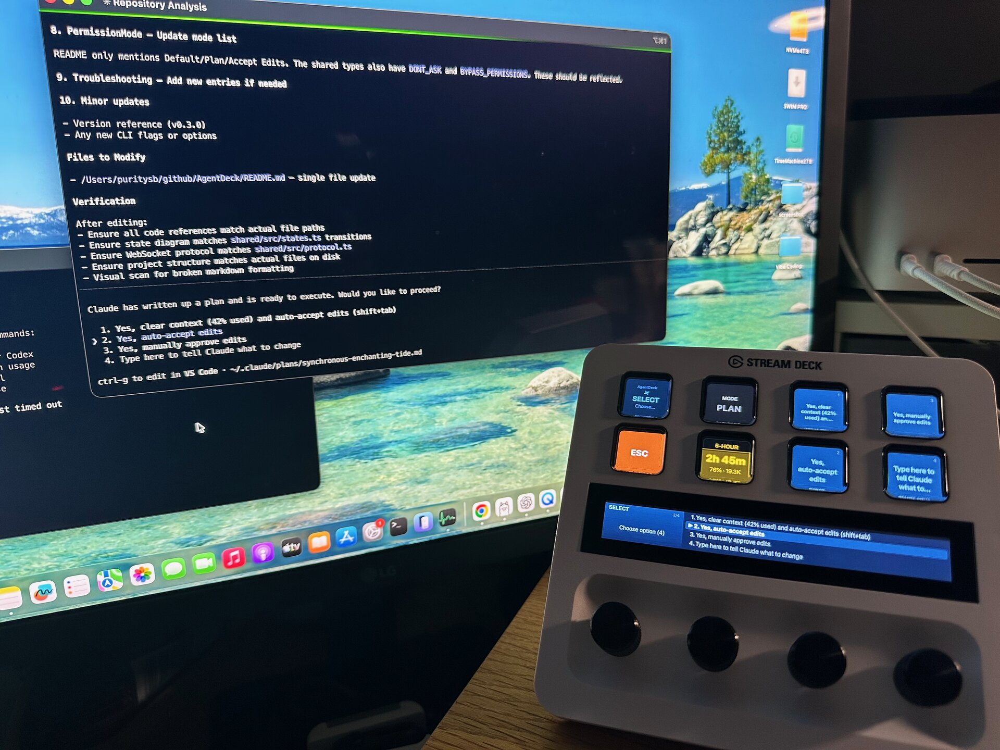
</p>

See **[Stream Deck+ Layout Reference](docs/streamdeck-layout.md)** for per-state ASCII diagrams, color tables, encoder details, and button label intelligence.

---

## Android Dashboard

Monitor and control your AI agents from any Android device — no Stream Deck required.

<p align="center">
  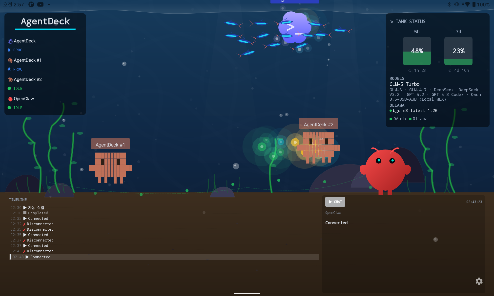
</p>
<p align="center"><em>Tablet mode — color terrarium with multi-session octopi, crayfish, neon tetra, and HUD overlay</em></p>

<p align="center">
  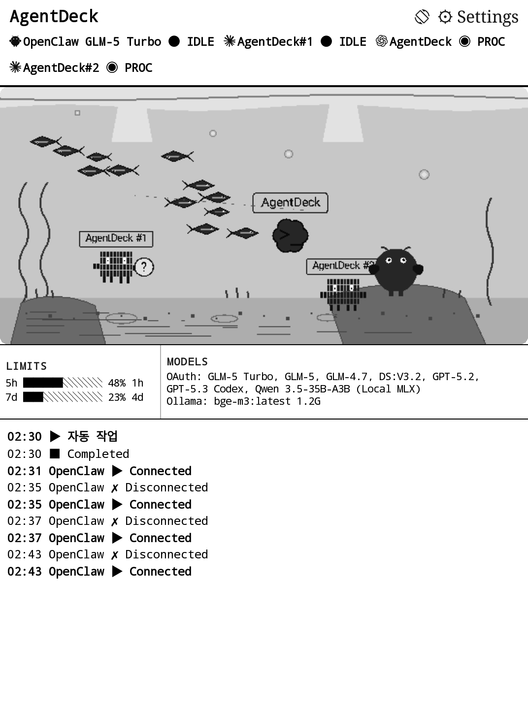
  &nbsp;&nbsp;
  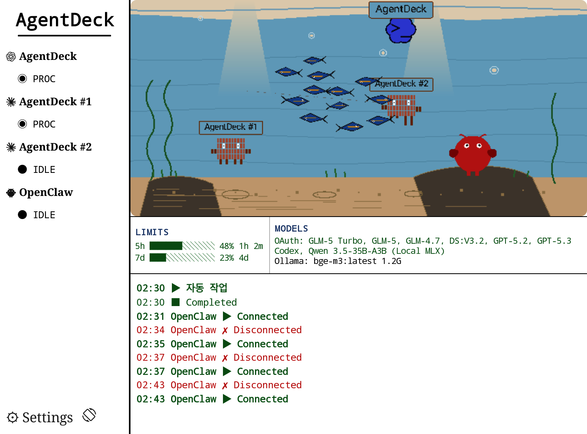
</p>
<p align="center"><em>E-ink mode — Crema S grayscale dashboard and Pantone 6 Kaleido 3 color dashboard</em></p>

The Android app connects to the same bridge server over your local network, giving you a second screen for agent monitoring and a full mirror of the Stream Deck controls.

### Two Display Modes

**E-ink mode** (Crema S, Onyx, Kobo)
- Aquarium-centered B&W dashboard — pixel art creatures in a 16-level grayscale terrarium
- Partial refresh zones: A2 (200ms) for fast UI, DU for status, FULL (500ms) for the aquarium
- Left panel (22%): agent list with state indicators
- Right panel (78%): aquarium + rate limits/models + event timeline

**Tablet mode** (Lenovo, general Android tablets)
- Full-color terrarium background with 60fps creature animation
- Semi-transparent HUD panels overlay agent status, rate limits, timeline
- Identical information to e-ink, expressed through color and motion

### Three-Tab Navigation

| Tab | Content |
|-----|---------|
| **Dashboard** | Terrarium background + HUD overlay panels. Connection overlay when disconnected (mDNS discovery, QR pairing) |
| **Deck** | Full Stream Deck+ mirror — 4 encoder panels (swipe/tap/long-press gestures) + 2x4 button grid with context area |
| **Settings** | Bridge connection, display preferences |

### Connect to Bridge

The app finds your bridge automatically:

1. **mDNS** — the bridge advertises `_agentdeck._tcp` on your local network; the app discovers it within seconds
2. **QR pairing** — run `agentdeck qr` on your Mac, scan with the app's camera (CameraX + ML Kit)
3. **Manual** — enter the bridge IP and port in Settings

Once connected, the app receives real-time state updates over WebSocket and can send commands back to the bridge.

See **[Android Reference](docs/android.md)** for device support, build/signing instructions, and creature behavior details.

---

## Apple Dashboard

Monitor and control your AI agents from iPhone, iPad, or Mac — a native SwiftUI experience.

<p align="center">
  
</p>

The Apple app is a SwiftUI multiplatform app that connects to the same bridge server, providing the full AgentDeck experience on Apple devices.

### Three-Tab Navigation

| Tab | Content |
|-----|---------|
| **Monitor** | Terrarium background + HUD overlay — agent status, rate limits, timeline |
| **Deck** | Stream Deck+ mirror — encoder panels + button grid with touch gestures |
| **Settings** | Bridge connection, display preferences |

### Connect to Bridge

- **mDNS** — automatic discovery of `_agentdeck._tcp` services on your local network
- **QR pairing** — scan with the in-app camera (`agentdeck qr` on your Mac)
- **Manual** — enter bridge IP and port

### iOS Foreground Recovery

The app handles iOS background/foreground transitions gracefully — WebSocket reconnects immediately on foregrounding, state syncs within milliseconds, and the terrarium animation resumes without flicker.

---

## TUI Dashboard

Monitor your agents directly in the terminal — no additional hardware or apps required.

```bash
agentdeck dashboard     # or: agentdeck dash
```

<p align="center">
  
</p>

The TUI connects to a running Bridge or Daemon over WebSocket and renders a real-time monitoring interface using raw ANSI escape codes. Zero additional dependencies.

- **Braille terrarium** — octopus, crayfish, neon tetra schools in a truecolor water gradient. State-driven: idle = floor, processing = swimming with starburst, awaiting = "?" bubble
- **Adaptive layout** — wide (120+ cols), standard (80-119), narrow (60-79). Terrarium hides when too small
- **Status + Timeline** — rate limit gauges, OAuth/Ollama models, tool calls, activity density bar
- **Auto-discovery** — finds Daemon or active session automatically; 3s auto-reconnect
- **SSH friendly** — works over any SSH connection with truecolor support; pipes output JSON

---

## ESP32 Display

Compact WiFi-connected displays for always-on agent monitoring.

<p align="center">
  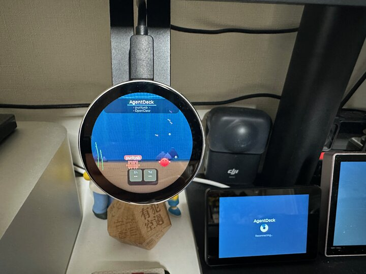
  &nbsp;&nbsp;
  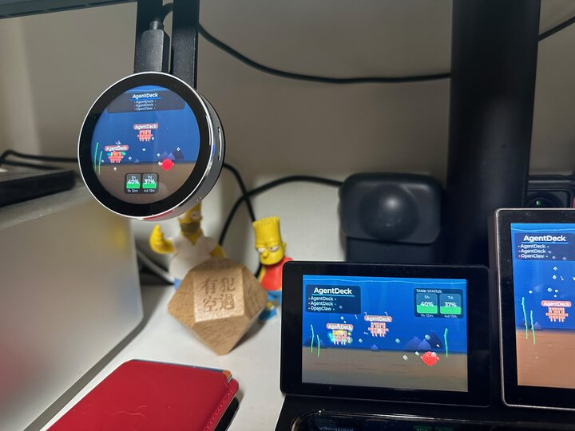
</p>
<p align="center"><em>Left: Round AMOLED close-up (1.8" circular) &nbsp;|&nbsp; Right: Round AMOLED + IPS LCD side by side</em></p>

### Supported Boards

| Board | Screen | Resolution |
|-------|--------|------------|
| **Round AMOLED** | 1.8" circular AMOLED | 466×466 |
| **IPS LCD** | 3.5" rectangular IPS | 480×320 |
| **B86 Box** | 4" wall-mount touch panel | 480×480 |
| **Ulanzi TC001** | 8×32 WS2812B RGB LED matrix | 256 pixels |

### Setup

Run `agentdeck wifi-setup` to provision WiFi over serial (see [CLI Reference](#cli-reference)). Once provisioned, the ESP32 connects to the bridge over WiFi WebSocket and displays a compact terrarium with agent status. PlatformIO firmware in `esp32/`.

---

## Pixoo64 LED Matrix

64×64 RGB LED pixel art terrarium on a Divoom Pixoo64.

<p align="center">
  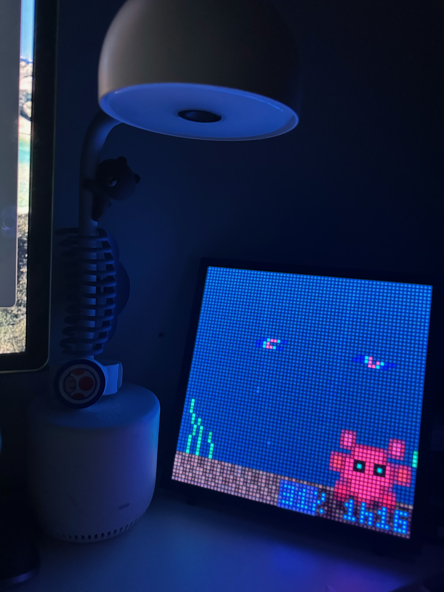
</p>

The Pixoo module renders dot-art creatures, water zone colors reflecting agent state, and a compact usage HUD — all pushed over HTTP to the device's local API.

Manage devices with `agentdeck pixoo {scan|add|list|remove|test}` — see [CLI Reference](#cli-reference).

> **Note:** The Pixoo's built-in HTTP server can crash under frequent requests. AgentDeck throttles updates automatically. Use `--no-pixoo` to disable if needed.

---

## Project Structure

```
AgentDeck/
├── shared/        # Shared TypeScript types (states, protocol, voice paths)
├── bridge/        # Node.js bridge server (PTY, hooks, WS, voice, adapters)
├── plugin/        # Stream Deck SDK v2 plugin (actions, renderers, utility modes)
├── hooks/         # Claude Code hook installer
├── setup/         # npm setup package (@agentdeck/setup)
├── android/       # Jetpack Compose dashboard (e-ink + tablet, terrarium, deck mirror)
├── apple/         # SwiftUI multiplatform app (iOS/iPad/macOS dashboard + deck mirror)
├── esp32/         # ESP32 firmware (round AMOLED / IPS LCD, PlatformIO)
├── config/        # Prompt templates + default settings
├── scripts/       # Install, uninstall, package, icon generation
└── docs/          # Documentation (voice, layout, android, protocol)
```

See **[Protocol & Architecture](docs/protocol.md)** for the full file tree, state machine diagram, and WebSocket message reference.

---

## Configuration

### Quick Action Buttons

The four Quick Action buttons (slots 3-6) are configurable via the Stream Deck Property Inspector. Defaults:

| Slot | Label | Action |
|------|-------|--------|
| 3 | GO ON | `continue` (sends prompt to continue) |
| 4 | REVIEW | `/review` |
| 5 | COMMIT | `/commit` |
| 6 | CLEAR | `/clear` |

Slot 3 also shows **START** when disconnected (spawns a new `agentdeck claude` session).

### Prompt Templates

Edit `config/prompt-templates.json` to customize the prompts cycled by the **Action encoder** (E2) rotate:

```json
{
  "templates": [
    { "label": "Fix Bug", "prompt": "Please fix the bug described above" },
    { "label": "Test", "prompt": "Write tests for the changes made" },
    { "label": "Review", "prompt": "Review the code for issues and suggest improvements" },
    { "label": "Explain", "prompt": "Explain how this code works step by step" }
  ]
}
```

---

## Troubleshooting

| Symptom | Cause | Fix |
|---------|-------|-----|
| Plugin shows DISCONNECTED | Bridge not running | Run `agentdeck claude` |
| Plugin reconnects every 3s | Bridge crashed | Restart `agentdeck claude` |
| Bridge enters disconnected state | Claude process exited | Restart `agentdeck claude` |
| State tracking not working | Hook server unreachable | Verify `agentdeck` is running |
| Stream Deck buttons inactive | Hardware not connected | Reconnect + restart app |
| Stuck in PROCESSING > 5 min | Agent stalled | STOP button or Ctrl+C in terminal |
| "Is sox installed?" | sox missing | See [Voice Setup](docs/voice-setup.md) |
| "Is whisper.cpp installed?" | whisper.cpp missing | See [Voice Setup](docs/voice-setup.md) |
| Voice transcription very slow / timeout | x86 whisper-cli (no Metal GPU) | Install arm64 Homebrew + whisper-cpp. See [Voice Setup](docs/voice-setup.md) |
| `whisper-cli: arm64=false, metal=false` | Using x86 binary through Rosetta | Install arm64 Homebrew at `/opt/homebrew/` |
| Plugin not in Stream Deck app | Plugin not linked | Restart Stream Deck app, then `cd plugin && streamdeck link .sdPlugin` |
| Hooks not firing | Hooks not installed or stale | `node hooks/dist/install.js` (re-installs all 7 hooks) |
| Need to remove hooks | Uninstalling AgentDeck | `node hooks/dist/install.js uninstall` |
| Plugin loads but buttons blank | Plugin needs rebuild | `pnpm build && pnpm generate-icons`, restart Stream Deck app |
| Android app can't find bridge | mDNS blocked on network | Use QR pairing (`agentdeck qr`) or enter IP manually in Settings |
| Android shows "Not Connected" | Bridge not reachable | Verify same LAN; for USB: `adb reverse tcp:9120 tcp:9120` then connect to 127.0.0.1:9120 |
| E-ink ghosting on Crema | Missing full GC16 refresh | State transitions trigger full refresh automatically; force refresh by toggling bridge connection |
| `posix_spawnp failed` | Prebuilt node-pty binary incompatible with Node version | `cd $(npm root -g)/@agentdeck/bridge/node_modules/node-pty && npx node-gyp rebuild` |

### tmux -CC Compatibility

When using iTerm2's `tmux -CC` (control mode): run `agentdeck claude` inside a tmux window. The bridge manages its own PTY, so there's no conflict.

Signal chain: `tmux → iTerm2 → agentdeck → bridge PTY → claude`

---

## Uninstall

```bash
bash scripts/uninstall.sh
```

Removes Claude Code hooks, unlinks `agentdeck` CLI, and removes the Stream Deck plugin symlink. **Restart the Stream Deck app** afterward.

---

## Development

```bash
pnpm -r --parallel dev    # Watch mode for all packages
cd plugin && pnpm build   # Rebuild plugin only
cd bridge && pnpm build   # Rebuild bridge only
pnpm -r typecheck         # Type check without building
```

### Testing

```bash
pnpm test                        # Run root Vitest suite (bridge, plugin, shared, hooks)
pnpm test -- --watch             # Watch mode
pnpm vitest run --coverage       # Coverage report (v8) + threshold check
pnpm test:report                 # Unified report script (Vitest + Android + Apple + Robot)
pnpm test:android                # Android suite via unified report script
```

The repository currently uses 4 test frameworks. The default `pnpm test` path only runs the root Vitest suite; Android, Apple, and ESP32 suites are executed through `scripts/test-report.sh`.

GitHub Pages publishes the current test dashboard at `https://puritysb.github.io/AgentDeck/reports/` with suite status, scenario coverage mapping, and coverage trends.

| Framework | Scope | Current inventory | Notes |
|-----------|-------|-------------------|-------|
| **Vitest** | `bridge`, `plugin`, `shared`, `hooks` | 26 `.test.ts` files | Root `pnpm test` and CI path |
| **JUnit + Robolectric** | Android unit tests | 4 Kotlin test files | Run via `./gradlew testDebugUnitTest` or `pnpm test:report` |
| **XCTest** | Apple app tests | 2 Swift test files | Run via `xcodebuild test` or `pnpm test:report` |
| **Robot Framework** | ESP32 validation | 3 Robot suites | Hardware-oriented, run via report script |

Coverage thresholds currently enforced by `vitest.config.ts` are lines ≥17%, functions ≥15%, branches ≥14%, statements ≥16%.

The current GitHub Actions CI workflow runs on every push/PR to `master` and executes `build → typecheck → vitest → vitest coverage` on `ubuntu-latest` with Node 20. Android, Apple, and ESP32 suites are not part of the default CI job.

See **[Testing Guide](docs/testing.md)** for full details on coverage, writing tests, and running the unified report.

Quick smoke test after changes:

```bash
pnpm build && pnpm test && agentdeck status
```

### Packaging

Build a distributable `.streamDeckPlugin` file:

```bash
pnpm package    # → dist/bound.serendipity.agentdeck.streamDeckPlugin
```

Recipients double-click to install. The bridge (`agentdeck`) and Claude Code CLI must be installed separately.

Published npm packages: `@agentdeck/shared`, `@agentdeck/bridge`, `@agentdeck/setup`.

### Debugging

Bridge logs print to the `agentdeck` terminal:
```
[agentdeck] Starting AgentDeck bridge on port 9120...
[agentdeck] Hook server listening on port 9120
[agentdeck] WebSocket server ready on port 9120
[agentdeck] Spawned: claude
[WsServer] Plugin connected
[StateMachine] DISCONNECTED -> idle (trigger: session_start, source: hook)
```

Stream Deck plugin logs: Stream Deck app → Settings → Logs.

---

## Roadmap

### Achieved

- [x] Android tablet + e-ink dashboard (Jetpack Compose)
- [x] Apple iOS/iPad/macOS dashboard (SwiftUI multiplatform)
- [x] Apple TestFlight CI pipeline
- [x] ESP32 compact displays (Round AMOLED, IPS LCD, B86 Box, Ulanzi TC001)
- [x] TUI terminal dashboard (Unicode Braille + ANSI)
- [x] Pixoo64 LED matrix pixel art
- [x] Codex CLI session support
- [x] Multi-agent visualization (Claude Code + OpenClaw creatures)
- [x] Daemon mode with multi-session aggregation
- [x] Voice assistant pipeline (wake word → STT → LLM → TTS)
- [x] Display sleep/wake sync across all surfaces
- [x] Color E-ink support (Kaleido 3)

### Planned

- Additional agent integrations (Opencode)
- Windows/Linux platform support
- Project-specific layout presets
- Custom button icon support
- App Store / Play Store distribution

---

<p align="center">
<strong>AgentDeck</strong> — Physical Control Surface for AI Coding Agents
</p>
