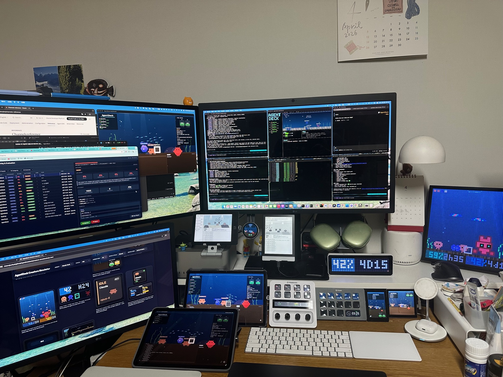
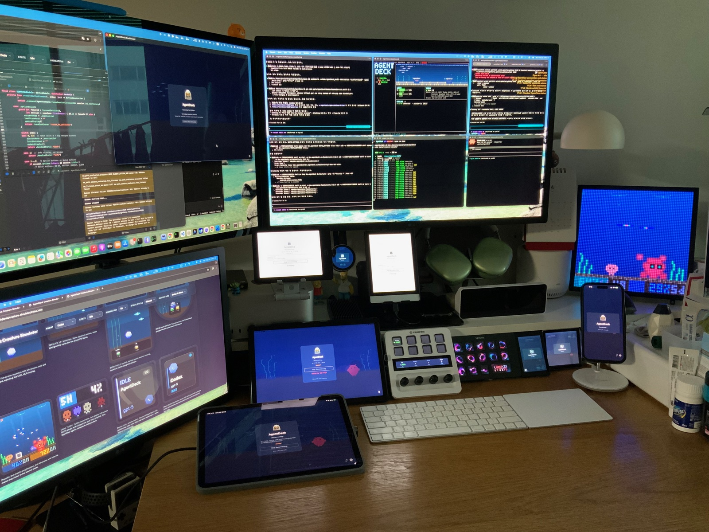
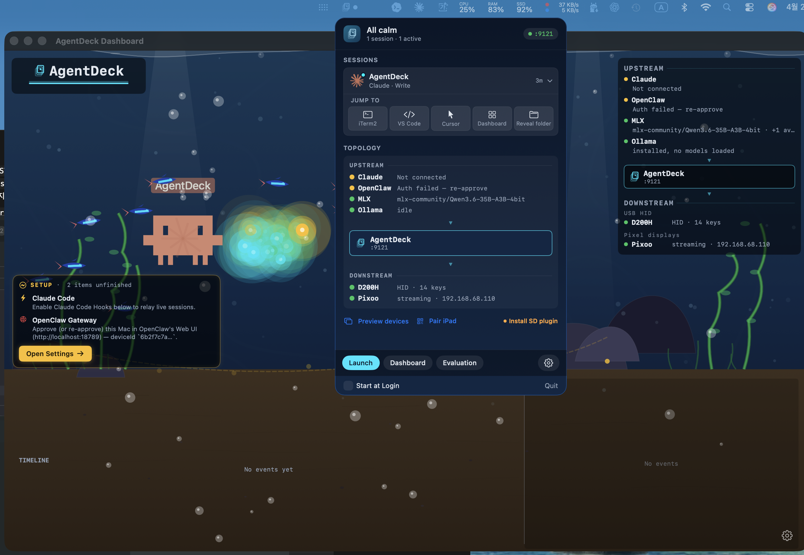

<p align="center">
  
</p>

# AgentDeck

<p align="center">
  <a href="LICENSE"></a>
  <a href="https://www.npmjs.com/package/@agentdeck/setup"></a>
  <a href="https://github.com/puritysb/AgentDeck/actions/workflows/ci.yml"></a>
  
</p>

<p align="center">
  
  = 22">
  
  
  
  
  
  
</p>

**Stop Chatting. Start Steering.**

AgentDeck is a physical control surface for AI coding agents. It started with an Elgato Stream Deck+ and now runs on **13 display surfaces simultaneously** — tablets, e-ink readers, phones, ESP32 modules, LED matrices, HID decks, and terminals.

> One bridge. 13 surfaces. Steer your AI — without leaving your keyboard flow.

> Independent project. Not affiliated with Anthropic, OpenAI, Google, Elgato, DIVOOM, or other third parties referenced. All trademarks are property of their respective owners. See [ATTRIBUTION.md](ATTRIBUTION.md) for full notices.

<p align="center">
  
</p>

<p align="center">
  <a href="https://youtu.be/s-f8ICBcC4o"><strong>Watch Demo on YouTube</strong></a>
</p>

<p align="center">
  
</p>

| | Requirement |
|---|---|
| **Platform** | macOS 15+ (Sequoia) — Windows/Linux not supported |
| **Hardware** | Elgato Stream Deck+ (8 keys, 4 encoders, LCD touch strip) |
| **Terminal** | iTerm2 (required for session management and voice paste) |
| **Android** | *(Optional)* Android 10+ tablet or e-ink reader for remote dashboard |
| **Apple** | *(Optional)* iOS 17+ / iPadOS 17+ / macOS 15+ for SwiftUI dashboard |
| **TUI** | *(Optional)* Any terminal with truecolor support for `agentdeck dashboard` |

---

## Table of Contents

- [What is AgentDeck?](#what-is-agentdeck)
- [Prerequisites](#prerequisites)
- [Quick Start](#quick-start)
- [Manual Build & Install](#manual-build--install)
- [Usage](#usage)
  - [CLI Reference](#cli-reference)
- [Stream Deck+ Layout (v4)](#stream-deck-layout-v4)
- [Ulanzi D200H Deck Dock](#ulanzi-d200h-deck-dock)
- [Android Dashboard](#android-dashboard)
- [Apple Dashboard](#apple-dashboard)
- [TUI Dashboard](#tui-dashboard)
- [Agent Performance Evaluation & Model Orchestration](#agent-performance-evaluation--model-orchestration)
- [ESP32 Display](#esp32-display)
- [Ulanzi TC001 LED Matrix](#ulanzi-tc001-led-matrix)
- [Pixoo64 LED Matrix](#pixoo64-led-matrix)
- [Configuration](#configuration)
- [Troubleshooting](#troubleshooting)
- [Uninstall](#uninstall)
- [Development](#development)
- [Next Milestones — Current Focus](#next-milestones--current-focus)
- [Roadmap](#roadmap)

### Documentation

- [Architecture](docs/architecture.md) — monorepo layout, BridgeCore, PtyAdapter, AgentAdapter, Gateway protocol
- [Daemon](docs/daemon.md) — daemon hub, singleton guard, mDNS recovery, usage relay, multi-surface monitoring
- [Plugin Conventions](docs/plugin-conventions.md) — encoder LCD, wide canvas, OC timeline pipeline, D200H HID, sleep/wake
- [v4 Layout](docs/v4-layout.md) — v4 Session-Per-Button keypad + encoder mapping, v3→v4 changes
- [Stream Deck+ Layout Reference](docs/streamdeck-layout.md) — per-state layouts, encoder details, button colors
- [TUI Dashboard](docs/tui-dashboard.md) — terrarium, sprites, adaptive layouts
- [Android Reference](docs/android.md) — device support, build/signing, creature behavior
- [Android UI/UX Vision](docs/android-ui.md) — e-ink + tablet layouts, creatures, refresh zones
- [ESP32 Reference](docs/esp32.md) — firmware boards, flash safety, WiFi provisioning, disconnect recovery
- [Device Reference](docs/devices.md) — dashboard device types, transport protocols, broadcast architecture
- [Protocol](docs/protocol.md) — state machine, WebSocket messages, project structure
- [Voice Setup](docs/voice-setup.md) — microphone + speech-recognition permissions (Apple on-device SFSpeech — no install needed)
- [Wake Word Detection](docs/wake-word.md) — Porcupine (Mac) + microWakeWord (ESP32) setup
- [Testing Guide](docs/testing.md) — test structure, coverage, CI pipeline, writing tests
- [Why APME — 감에서 데이터로](docs/why-apme.md) — motivation, category-aware evaluation strategy, composite score design
- [APME Pipeline (8-layer deep dive)](docs/apme-pipeline.md) — ingestion (hook/timeline/PTY), collector→store, classifier, runner, tuner, HTTP/WS, device rendering with file:line anchors
- [Agent Performance Evaluation Reference](docs/apme.md) — session dataset, category-specific rubrics, turn-level mid-session eval, daemon HTTP API, settings
- [Creature Simulator Demo](https://puritysb.github.io/AgentDeck/demo/) — live creature rendering playground (GitHub Pages)

---

## What is AgentDeck?

A **control surface** — like an audio mixing console, but for AI coding agents. It reads your agent's state in real-time and dynamically reconfigures buttons and encoders to match what's happening right now.

- **Respond instantly** — YES / NO / ALWAYS buttons appear with semantic colors for permission prompts
- **Interrupt** — STOP button sends Ctrl+C to a runaway agent
- **Switch modes** — cycle Plan / Accept Edits / Default
- **Navigate options** — encoder scrolls and selects multi-choice prompts on a wide-canvas LCD
- **Voice input** — push-to-talk → Apple SFSpeech (on-device) → auto-send (offline, zero setup)
- **Voice assistant** — wake word detection → Apple SFSpeech STT → LLM → AVSpeech TTS response (fully offline)
- **Display sync** — macOS sleep dims all connected surfaces; wake restores instantly
- **Terminal postit** — agent state shown in iTerm2 tab titles and badges
- **Monitor usage** — animated water-gauge dashboard with rate limit countdowns
- **Quick actions** — GO ON / REVIEW / COMMIT / CLEAR; encoder cycles custom prompts
- **System utilities** — volume, mic, media, timer from the Utility encoder
- **Terminal sessions** — iTerm dial switches sessions, auto-attaches tmux
- **Multiple coding agents** — Claude Code, Codex CLI, OpenCode, and OpenClaw in one multi-agent daemon view
- **Works from anywhere** — all 13 surfaces can monitor the agent; interactive surfaces (Stream Deck, D200H, Android, Apple) can also control it

The bridge is transparent: if it's off, Claude Code works exactly as before.

### Supported Agents

| Agent | Status |
|-------|--------|
| **Claude Code** | Supported (primary) |
| **Codex CLI** | Supported — PTY parser, model detection, dashboard integration |
| **OpenCode** | Supported — PTY + SSE hybrid bridge, timeline integration |
| **OpenClaw** | Experimental — Gateway WebSocket, timeline panel, log stream |

### Supported Surfaces — 13 Types

| # | Surface | Description |
|---|---------|-------------|
| 1 | **Stream Deck+** | Primary — 8 keys, 4 encoders, LCD touch strip (v4 session-per-button) |
| 2 | **Ulanzi D200H Deck Dock** | 14-key HID controller + 960×540 LCD — multi-session agent controller, usage monitor, premium CoreGraphics widgets |
| 3 | **Android Tablet** | Color terrarium + HUD overlay (60fps) |
| 4 | **E-ink Reader** | B&W 16-level grayscale + **Color E-ink** (Kaleido 3, 4096 colors) + partial refresh |
| 5 | **iPhone** | SwiftUI app — mobile agent monitoring |
| 6 | **iPad** | SwiftUI app — terrarium second screen |
| 7 | **macOS** | SwiftUI app — desktop monitoring window + in-process Swift daemon |
| 8 | **ESP32 Round AMOLED** | 1.8" circular 466×466 — compact WiFi display |
| 9 | **ESP32 IPS LCD** | 3.5" rectangular 480×320 |
| 10 | **ESP32 B86 Box** | 4" wall-mount touch panel 480×480 |
| 11 | **Ulanzi TC001** | 8×32 RGB LED matrix — compact HUD pages and creature sprites |
| 12 | **Pixoo64 LED** | 64×64 RGB LED pixel art terrarium |
| 13 | **TUI Terminal** | Unicode braille terrarium + ANSI dashboard — SSH/remote |

<p align="center">
  
  &nbsp;&nbsp;
  
</p>
<p align="center"><em>Left: iPad + iPhone (SwiftUI) &nbsp;|&nbsp; Right: ESP32 3 types + Pixoo64 LED</em></p>

<p align="center">
  
  &nbsp;&nbsp;
  
</p>
<p align="center"><em>Left: Dual E-ink — B&W (Crema S) + Color (Pantone 6) + ESP32 AMOLED &nbsp;|&nbsp; Right: TUI terminal dashboard</em></p>

### Architecture

```
                              ┌── Daemon (port 9120, sole hub) ──┐
Stream Deck Plugin ◄── WS ──►│                                   │
D200H Deck Dock    ◄ USB HID►│                                   │
Android Dashboard  ◄── WS ──►│  WS Server + mDNS + Device Mods   │
Apple Dashboard    ◄── WS ──►│  Gateway Proxy + Usage Relay      │
TUI Dashboard      ◄── WS ──►│  Pixoo + ESP32 Serial + SSE       │
ESP32 Display      ◄ Serial ►│                                   │
Pixoo64 LED        ◄ HTTP ──►└───────────────┬───────────────────┘
                                             │ aggregates
                              ┌── Session Bridge (port 9121+) ──┐
User's Terminal ◄─ stdio ───►│  PTY Manager → claude CLI         │
Claude Code Hooks ─ HTTP ───►│  Output Parser → State Machine    │
                              │  Hook Server + Voice (SFSpeech)   │
                              └──────────────────────────────────┘
```

The daemon is the sole hub for all dashboard clients. Session bridges handle PTY + hooks only. The daemon aggregates state from all sessions and broadcasts to all 13 surfaces. Local clients are auto-trusted; LAN clients authenticate with a token stored in the AgentDeck data directory (`~/.agentdeck/auth-token` for Node CLI / unsigned dev builds, `~/Library/Containers/bound.serendipity.agentdeck.dashboard/Data/Library/Application Support/AgentDeck/auth-token` for the Mac App Store build — routed through `AgentDeckPaths.swift`). Interactive surfaces (Stream Deck, D200H, Android, Apple) can control the agent; monitoring surfaces (Pixoo, TUI, ESP32) display state.

On macOS, the AgentDeck Dashboard SwiftUI app ships with a full **in-process Swift daemon** (47 files, ~20,500 LOC) that re-implements the Node.js bridge — mDNS, device modules (ADB/Serial/Pixoo/D200H), Gateway proxy, and WebSocket server. Installing the macOS app gives you the full bridge without Node.js. The `agentdeck` CLI remains the canonical path for Claude Code / Codex / OpenCode PTY sessions.

---

## Prerequisites

| Item | Required | Install |
|------|----------|---------|
| **macOS 15+** (Sequoia) | Yes | Windows/Linux not supported |
| **Xcode Command Line Tools** | Yes | `xcode-select --install` (node-pty native build) |
| **Node.js** >= 22 | Yes | `brew install node` |
| **pnpm** >= 9 | Yes | `npm install -g pnpm` |
| **Python 3** | Yes | `brew install python` (display sleep detection) |
| **Elgato Stream Deck app** >= 6.7 | Yes | [Elgato Downloads](https://www.elgato.com/downloads) |
| **Stream Deck+ hardware** | Yes | 8 keys + 4 encoders + LCD touch strip |
| **iTerm2** | Yes | Terminal management, voice paste, session switching |
| **Claude Code CLI** | Yes | `npm install -g @anthropic-ai/claude-code` |
| **JDK 17+** | For Android | `brew install openjdk@17` |
| **Stream Deck CLI** | Auto | Installed by `pnpm setup` if missing |
| **Microphone + Speech Recognition** | For voice | Grant on first use (macOS Settings → Privacy). No sox, whisper, or model download — Apple SFSpeech on-device |

---

## Quick Start

```bash
# Option A: npm install (no clone needed)
npx @agentdeck/setup

# Option B: from source
git clone https://github.com/puritysb/AgentDeck.git && cd AgentDeck && pnpm setup
```

The `pnpm setup` command:
1. Checks required dependencies (Node.js 22+, pnpm, Claude CLI, Stream Deck app)
2. Installs `@elgato/cli` if missing
3. Runs `pnpm install` + `pnpm build`
4. Generates icon assets (16 PNGs)
5. Installs Claude Code hooks
6. Links the Stream Deck plugin
7. Links the `agentdeck` CLI globally
8. (Voice is built-in via Apple SFSpeech on-device — no extra install)

After setup, **restart the Stream Deck app**, then run:

```bash
agentdeck claude
```

You're steering.

---

## Manual Build & Install

### Build

```bash
cd AgentDeck
pnpm install
pnpm build            # shared → bridge, plugin, hooks
pnpm generate-icons   # SVG → PNG (required on first build)
```

### 1. Install Claude Code Hooks

**Node CLI install (dev + Homebrew distribution):**

```bash
node hooks/dist/install.js
```

Registers 7 hooks in `~/.claude/settings.local.json`: `SessionStart`, `SessionEnd`, `PreToolUse`, `PostToolUse`, `Stop`, `Notification`, `UserPromptSubmit`. Each hook POSTs JSON to the bridge. Remove with `node hooks/dist/install.js uninstall`.

**Mac App Store install:** hooks are **opt-in** — the app shows a Settings → Claude Code Hooks pane with an "Enable Claude Code Hooks…" button that presents an NSAlert explaining what will be written, then an NSOpenPanel so the user explicitly selects `~/.claude/settings.local.json`. Only after that consent does AgentDeck write the hook entries (via a security-scoped bookmark). "Remove" in the same pane cleanly unregisters and revokes the bookmark. No command line required.

### 2. Link Stream Deck Plugin

```bash
cd plugin && streamdeck link .sdPlugin
```

Creates a symlink in `~/Library/Application Support/com.elgato.StreamDeck/Plugins/`. **Restart the Stream Deck app** to load.

### 3. Link `agentdeck` CLI

```bash
cd bridge && pnpm link --global
```

### 4. Voice Setup (Zero install)

Voice input uses Apple's on-device `SFSpeechRecognizer` (Speech framework). **No sox, no whisper.cpp, no model downloads** — the OS manages the dictation model via Settings → General → Keyboard → Dictation, which AgentDeck piggybacks on. The only user action is granting Microphone + Speech Recognition permission the first time the voice button is pressed (macOS shows the standard TCC prompts backed by `NSMicrophoneUsageDescription` and `NSSpeechRecognitionUsageDescription`).

All audio stays on-device (`requiresOnDeviceRecognition = true`), so the captured WAV — which may contain project/code names — never leaves the machine. See [Voice Setup Guide](docs/voice-setup.md) for permission troubleshooting and wake-word details.

---

## Usage

### Start

```bash
agentdeck claude   # or: agentdeck codex
```

This spawns Claude Code or Codex CLI inside a PTY and starts a session bridge on a dynamic port (HTTP + hooks). Your terminal works exactly as before — the Stream Deck adds a parallel control channel. The **daemon** (port 9120, `0.0.0.0`) aggregates all sessions for external clients.

> **Security:** The daemon binds to `0.0.0.0` for LAN access (multi-surface monitoring). Local connections bypass authentication. Remote connections require the auth token from the AgentDeck data directory (`~/.agentdeck/auth-token` on Node CLI builds, `~/Library/Containers/bound.serendipity.agentdeck.dashboard/Data/Library/Application Support/AgentDeck/auth-token` on Mac App Store).

### CLI Reference

The CLI command is `agentdeck`.

#### Sessions

| Command | Description |
|---------|-------------|
| `agentdeck claude` | Start Claude Code session (PTY + bridge) |
| `agentdeck codex` | Start Codex CLI session (PTY + bridge) |
| `agentdeck opencode` | Start OpenCode session (PTY + SSE bridge) |
| `agentdeck monitor` | Hook-only bridge (no PTY — run `claude` separately) |

**Flags:** `-p <port>`, `-c <command>`, `-d` (debug), `--no-update-check`
**Module flags:** `--local` (all off), `--no-mdns`, `--no-adb`, `--no-serial`, `--no-pixoo`

#### Daemon

| Command | Description |
|---------|-------------|
| `agentdeck daemon start` | Start monitoring daemon |
| `agentdeck daemon stop` | Stop daemon |
| `agentdeck daemon restart` | Restart daemon |
| `agentdeck daemon status` | Show daemon status |
| `agentdeck daemon install` | Register macOS LaunchAgent (auto-start) |
| `agentdeck daemon uninstall` | Remove LaunchAgent |

#### Session Management

| Command | Description |
|---------|-------------|
| `agentdeck status` | All sessions + daemon status |
| `agentdeck stop` | Stop a session (`-a` for all, `-p` for specific port) |

#### Monitoring

| Command | Description |
|---------|-------------|
| `agentdeck dashboard` | TUI monitoring dashboard (alias: `dash`) |
| `agentdeck devices` | Connected devices (WS, ESP32, Pixoo, ADB) |
| `agentdeck qr` | Pairing QR code + URL |
| `agentdeck diag` | Diagnostic dump (`-a` for AI analysis) |

#### Evaluation (APME)

| Command | Description |
|---------|-------------|
| `agentdeck apme runs` | List recent runs (filter by `--agent`, `--model`, `--limit`) |
| `agentdeck apme run <id>` | Detailed run view — steps, turns, per-turn evals, vibe |
| `agentdeck apme judge` | Evaluate pending runs manually (no daemon required) |
| `agentdeck apme scorecard` | Model scorecard by category and overall |
| `agentdeck apme tune` | Trigger rubric auto-tuner (OPRO loop) |
| `agentdeck apme vibe <runId> <verdict>` | Label a run (`approve`/`reject`/`neutral`) |
| `agentdeck apme tag <runId> <category>` | Manually set task category |
| `agentdeck apme reclassify` | Re-run classifier on unclassified runs |
| `agentdeck apme rubric` | Inspect current rubrics |
| `agentdeck apme export` | Export dataset to JSON |

#### Device Setup

| Command | Description |
|---------|-------------|
| `agentdeck pixoo scan` | Discover Pixoo devices on LAN |
| `agentdeck pixoo add <ip>` | Add a Pixoo device |
| `agentdeck pixoo list` | List configured devices |
| `agentdeck pixoo remove <ip>` | Remove a device |
| `agentdeck pixoo test [ip]` | Send test pattern |
| `agentdeck wifi-setup` | ESP32 WiFi provisioning (serial) |

---

## Stream Deck+ Layout (v4)

<p align="center">
  
</p>

v4 is **session-per-button**: all 8 keypad slots use a single `session-slot` action. List view shows one session per button; pressing a session enters a detail view with options/presets/ESC.

### Keypad — List View (8 sessions)

```
┌─────────┬─────────┬─────────┬─────────┐
│ SESS 1  │ SESS 2  │ SESS 3  │ SESS 4  │
├─────────┼─────────┼─────────┼─────────┤
│ SESS 5  │ SESS 6  │ SESS 7  │  NEXT   │
└─────────┴─────────┴─────────┴─────────┘
```

OpenClaw sits first, then coding agents (Claude / Codex / OpenCode) ordered by port. Slot 7 paginates when there are 8+ sessions. When no daemon is running, slot 0 becomes **▶ START** and launches the macOS AgentDeck Dashboard app.

### Keypad — Detail View (press a session)

| Slot | Content |
|------|---------|
| 0 | **BACK** — return to list |
| 1 | **Session Info** — project + model + state + agent watermark |
| 2-3 | **Content** — permission options, prompt presets, OpenClaw presets (STATUS / MODEL / GATEWAY) |
| 4 | **ESC / STOP** — always visible; bright when active, dimmed when idle |
| 5-6 | **Content** — more options/presets |
| 7 | **NEXT** — paginate when 5+ options |

### Encoders — 4 Slots

| Encoder | Action | Rotate | Push | Touch |
|---------|--------|--------|------|-------|
| E1 | **Utility** | Adjust value (volume, mic, timer) | Toggle / Action | Switch mode |
| E2 | **Action** | Scroll options / cycle prompts | Send prompt / Confirm | Same as push |
| E3 | **Usage** | Cycle pages (overview / 5h / 7d / session / extra) | Refresh usage data | Next page |
| E4 | **Voice** | Scroll transcription text | Hold = record, tap (<500ms) = cancel, VT push = send/paste | — |

<p align="center">
  
  &nbsp;&nbsp;
  
</p>
<p align="center"><em>Left: Voice transcription (Korean) on wide-canvas LCD &nbsp;|&nbsp; Right: Model selection with encoder option list</em></p>

### Dynamic Button States

Detail-view content slots (2-3, 5-6) reconfigure based on agent state — permission prompts get semantic colors (green=approve, red=deny, blue=permanent), options get teal/green, and 5+ options collapse into encoder wide-canvas mode or paginate via NEXT.

<p align="center">
  
</p>

See **[v4 Layout](docs/v4-layout.md)** for the full v4 session-per-button model, OpenClaw presets, and v3→v4 migration notes, or **[Stream Deck+ Layout Reference](docs/streamdeck-layout.md)** for per-state ASCII diagrams, color tables, encoder details, and button label intelligence.

---

## Ulanzi D200H Deck Dock

A 14-key USB HID controller with a 960×540 LCD — a second hardware surface that complements the Stream Deck+ with richer session visuals and a dedicated usage monitor.

<p align="center">
  
</p>
<p align="center"><em>Left to right: Stream Deck+, Ulanzi D200H Deck Dock (lit session slots), Ulanzi TC001 LED matrix</em></p>

### Layout

- **13 session buttons** — one per session (same OpenClaw-first ordering as Stream Deck+), with agent-colored watermarks, project name, and state indicator baked into each key image
- **1 big merged usage button** (col3+col4, row2) — dedicated usage monitor with live 5h/7d gauges
- **Press feedback** — a bright press-flash on every keydown for tactile confirmation even without force touch

<p align="center">
  
</p>
<p align="center"><em>D200H session keys lit in a full desk view — 13 sessions rendered side-by-side with the Stream Deck+ keypad</em></p>

### Transport

- **HID over USB** — VID `0x2207`, PID `0x0019`. The Node.js daemon and the macOS in-process Swift daemon both drive the device; whichever is running claims it. Sandboxed macOS builds require the **USB device** entitlement and Input Monitoring permission.
- **Heartbeat resilience** — the HID session auto-recovers from hub resets and sleep/wake cycles.
- **Shared renderers** — session slot imagery is generated from shared SVG renderers in `@agentdeck/shared`, so Stream Deck+, D200H, Android, and Apple surfaces stay visually consistent.

The D200H is not required — it layers on top of a running daemon. Plug it in and it shows up in `agentdeck devices`; nothing else to configure.

---

## Android Dashboard

Monitor and control your AI agents from any Android device — no Stream Deck required.

<p align="center">
  
</p>
<p align="center"><em>Tablet mode — color terrarium with multi-session octopi, crayfish, neon tetra, and HUD overlay</em></p>

<p align="center">
  
  &nbsp;&nbsp;
  
</p>
<p align="center"><em>E-ink mode — Crema S grayscale dashboard and Pantone 6 Kaleido 3 color dashboard</em></p>

The Android app connects to the same bridge server over your local network, giving you a second screen for agent monitoring and a full mirror of the Stream Deck controls.

### Two Display Modes

**E-ink mode** (Crema S, Onyx, Kobo)
- Aquarium-centered B&W dashboard — pixel art creatures in a 16-level grayscale terrarium
- Partial refresh zones: A2 (200ms) for fast UI, DU for status, FULL (500ms) for the aquarium
- Left panel (22%): agent list with state indicators
- Right panel (78%): aquarium + rate limits/models + event timeline

**Tablet mode** (Lenovo, general Android tablets)
- Full-color terrarium background with 60fps creature animation
- Semi-transparent HUD panels overlay agent status, rate limits, timeline
- Identical information to e-ink, expressed through color and motion

### Three-Tab Navigation

| Tab | Content |
|-----|---------|
| **Dashboard** | Terrarium background + HUD overlay panels. Connection overlay when disconnected (mDNS discovery, QR pairing) |
| **Deck** | Full Stream Deck+ mirror — 4 encoder panels (swipe/tap/long-press gestures) + 2x4 button grid with context area |
| **Settings** | Bridge connection, display preferences |

### Connect to Bridge

The app finds your bridge automatically:

1. **mDNS** — the bridge advertises `_agentdeck._tcp` on your local network; the app discovers it within seconds
2. **QR pairing** — run `agentdeck qr` on your Mac, scan with the app's camera (CameraX + ML Kit)
3. **Manual** — enter the bridge IP and port in Settings

Once connected, the app receives real-time state updates over WebSocket and can send commands back to the bridge.

See **[Android Reference](docs/android.md)** for device support, build/signing instructions, and creature behavior details.

---

## Apple Dashboard

Monitor and control your AI agents from iPhone, iPad, or Mac — a native SwiftUI experience.

<p align="center">
  
</p>

The Apple app is a SwiftUI multiplatform app that connects to the bridge on iOS/iPadOS, and **on macOS ships with a full in-process Swift daemon** (47 files, ~20,500 LOC) — mDNS, device modules (ADB/Serial/Pixoo/D200H), Gateway proxy, and WebSocket server — so the macOS build works standalone without Node.js. You can still use the `agentdeck` CLI alongside it for Claude Code / Codex / OpenCode PTY sessions; the app's daemon auto-detects and defers to a running CLI daemon on the same port.

### Three-Tab Navigation

| Tab | Content |
|-----|---------|
| **Monitor** | Terrarium background + HUD overlay — agent status, rate limits, timeline |
| **Deck** | Stream Deck+ mirror — encoder panels + button grid with touch gestures |
| **Settings** | Bridge connection, display preferences |

### macOS Menu Bar Popup

On macOS the app always lives in the menu bar — one click reveals the full topology without taking over a window.

<p align="center">
  
</p>

- **Sessions** — live session list with agent, state, and model; per-row Jump To buttons open the Pixoo view, the Stream Deck Code view, the full Dashboard window, or reveal the session data folder in Finder
- **Topology** — `UPSTREAM` (Claude Code hooks, OpenClaw Gateway, MLX, Ollama) and `DOWNSTREAM` (D200H, Pixoo, ESP32, Android) with LED dots driven by the shared `ProviderRailEvaluator`, so Settings / Dashboard / menu bar can never disagree about "is Claude connected?"
- **Tabs** — Launch · Dashboard · Evaluation switch the popup body without opening a window; a `Start at Login` toggle + `Quit` sit in the footer

### Connect to Bridge

- **mDNS** — automatic discovery of `_agentdeck._tcp` services on your local network
- **QR pairing** — scan with the in-app camera (`agentdeck qr` on your Mac)
- **Manual** — enter bridge IP and port

### iOS Foreground Recovery

The app handles iOS background/foreground transitions gracefully — WebSocket reconnects immediately on foregrounding, state syncs within milliseconds, and the terrarium animation resumes without flicker.

### App Store Distribution

The macOS and iOS builds are ready for App Store submission. The macOS build ships as a **self-contained Swift daemon** gated by the `AGENTDECK_APP_STORE` compile flag — no bundled Node.js, no bundled `adb`, no subprocess spawn, no AppleScript. User data lives in the app sandbox container (`~/Library/Containers/bound.serendipity.agentdeck.dashboard/Data/Library/Application Support/AgentDeck/`, not `~/.agentdeck/`) per Apple Review Guideline 2.5.2. USB entitlements for D200H HID and Input Monitoring permission handling are wired; the first-launch onboarding asks for Claude Code hook access via explicit NSOpenPanel consent. OpenClaw integration uses the Gateway-native WebSocket path (see §OpenClaw Gateway below), not a file-based identity. TestFlight builds available now; App Store review is the active milestone.

### OpenClaw Gateway (Gateway-native pairing)

AgentDeck connects to the OpenClaw Gateway over WebSocket (`ws://127.0.0.1:18789`) as an operator client. Pairing uses two handshake formats so both distributions work:

- **Mac App Store build (v3 self-generated identity)**: on first launch AgentDeck generates an Ed25519 keypair and stores the private key in the macOS Keychain (`accessibleAfterFirstUnlockThisDeviceOnly`). `deviceId = sha256(raw 32-byte public key).hex`. The Gateway returns a `deviceToken` in `hello-ok.auth.deviceToken`; it's persisted and reused on reconnect. No file read of `~/.openclaw/identity/` — sandbox-safe per Apple 2.5.2. Default scopes: `operator.read`, `operator.write`, `operator.approvals`. To pair, run `openclaw devices approve <requestId>` (or use OpenClaw's Web UI) once; the dashboard flips from Pairing required → Connected.
- **CLI / Homebrew build (v2 file-based identity)**: reads `~/.openclaw/identity/device.json` created by `openclaw pair`, for historical parity with the Node bridge.

Both builds share the same RPC surface: `connect`, `health`, `models.list`, `logs.tail`, `sessions.list/subscribe`, `chat.send/abort`, `exec.approval.resolve`, `system-presence`. Events: `connect.challenge`, `health`, `sessions.changed`, `session.message/tool`, `chat`, `exec.approval.requested/resolved`, `presence`, `tick`, `shutdown`. All subprocess-based fallbacks (`openclaw doctor`, `openclaw logs --follow`, `openclaw models list`) are compile-out in the App Store build and replaced with Gateway RPCs. See [docs/gateway-protocol.md](docs/gateway-protocol.md) for wire format + parity fixtures.

Auth failures (`missing_token`, `pairing_required`, `token_mismatch`, `device_auth_invalid`) do **not** auto-loop; the Settings pairing-state UI surfaces each case so the user can resolve deliberately. Remote / TLS-pinned Gateway support is deferred to v2; v1 officially targets loopback.

---

## TUI Dashboard

Monitor your agents directly in the terminal — no additional hardware or apps required.

```bash
agentdeck dashboard     # or: agentdeck dash
```

<p align="center">
  
</p>

The TUI connects to a running Bridge or Daemon over WebSocket and renders a real-time monitoring interface using raw ANSI escape codes. Zero additional dependencies.

- **Braille terrarium** — octopus, crayfish, neon tetra schools in a truecolor water gradient. State-driven: idle = floor, processing = swimming with starburst, awaiting = "?" bubble
- **Adaptive layout** — wide (120+ cols), standard (80-119), narrow (60-79). Terrarium hides when too small
- **Status + Timeline** — rate limit gauges, OAuth/Ollama models, tool calls, activity density bar
- **Auto-discovery** — finds Daemon or active session automatically; 3s auto-reconnect
- **SSH friendly** — works over any SSH connection with truecolor support; pipes output JSON

---

## Agent Performance Evaluation & Model Orchestration (APME)

**The problem:** I route 6+ LLMs (Claude Opus/Sonnet, Codex/GPT-5.4, Gemini Antigravity, GLM-5.1, Qwen3.5-30B MLX) across my daily work by **gut feeling** — "this task to Codex, summaries to local Qwen, important stuff to Opus." I have no idea if that's efficient. Generic benchmarks don't answer it either — they measure average users on standard tasks, not **me on my codebase**.

APME is the personalized evaluation system that fixes this. Every agent session → local SQLite dataset → category-aware auto-evaluation → eventually data-driven model routing.

<p align="center">
  
</p>

### Category-aware Evaluation Strategy

The key architectural decision: **evaluation method differs per task category.** A single "overall score" across all sessions is meaningless — a model that's great at debugging may be verbose in conversation, and vice versa.

| Categories | Timing | Layers |
|---|---|---|
| `coding` · `refactoring` · `debugging` | **Run-level** (after session ends) | Deterministic (lint/build/test) + LLM judge with category rubric |
| `conversation` · `planning` · `research` · `review` | **Turn-level / Task-level** (immediately after each turn, or after a task boundary like `/clear`) | LLM judge only — no git diff needed |
| `ops` · `multi_agent` · `unknown` | Run-level | Deterministic + general rubric fallback |

Seven dedicated rubrics — conversation scores `accuracy · helpfulness · conciseness`, debugging scores `diagnosis · fix_quality · verification`, and so on. Same model can be great at debugging and average at conversation — that's **normal**, and the scorecard surfaces it.

### Three Ingestion Paths → One Schema

Each agent emits events in a different shape. APME converges three paths onto a single `ApmeCollector` API:

```
  Claude Code   ──▶  hook HTTP POST + PTY ⏺ tail parser
  OpenClaw/OC   ──▶  adapter timeline events
  Codex CLI     ──▶  PTY parser (spinner_stop + tail)
                │
                ▼
           ApmeCollector  →  {data dir}/apme.sqlite   # ~/.agentdeck/ (CLI)  |  ~/Library/Containers/bound.serendipity.agentdeck.dashboard/Data/Library/Application Support/AgentDeck/ (App Store)
```

Claude Code's `Stop` hook fires only ~18% of the time in v2.1.104, so the primary response-capture path is PTY ring buffer parsing at the `⏺` marker, with a 3-path fallback for the `spinner_stop` vs `UserPromptSubmit` race.

### Composite Score (4-dimensional weighted sum)

A single judge score is unreliable. APME combines four independent signals so one bad signal can't poison the run:

```
composite = 0.40 × outcome      ← did it actually finish? (git diff / response captured)
          + 0.40 × judge         ← LLM quality score
          + 0.15 × efficiency    ← tokens/cost/time per change
          + 0.05 × vibe          ← user approve/reject
```

Coding outcomes are git-based (`committed → 1.0`, `iterated → 0.6`, `exploratory → 0.5`, `abandoned → 0.2`, …). Non-coding outcomes are response-based — a research session that changes no files isn't "abandoned" if the answer was delivered.

### Vibe-first, Judge Second

Counterintuitively, APME **doesn't try to make the LLM judge great upfront**. Instead:

1. **Collect** everything (Stage 1 ✅)
2. **Classify** into 10 categories (Stage 2 ✅)
3. **Human labels** run-by-run via dashboard 👍/👎 — this is ground truth (Stage 3 🔧)
4. **Auto-tune** the judge rubric against human labels via OPRO (Stage 4 🧪)

Without vibe data there's no way to verify the judge is right. So humans label first, and the judge evolves toward the human baseline. The tuner picks up **disagreement samples** (`tests_pass=1 ∧ judge<0.5`, `vibe=reject ∧ judge>0.8`, etc.), proposes new rubrics, shadow-scores them, and only accepts rubrics that improve the vibe correlation.

### Local-only Judge Backends (zero cost, full coverage)

Judge runs on **local backends only** so `sampleRate: 1.0` (evaluate everything) is the default — no cost anxiety, no guilt-driven sampling cuts.

| Backend | Endpoint | Role |
|---|---|---|
| `mlx` | `127.0.0.1:8800` (Qwen3.5-30B) | Primary (Node CLI/Brew) |
| `foundationModels` | in-process Swift daemon | Primary (App Store macOS build via Apple Intelligence) |
| `openclaw` | `127.0.0.1:18789` (Gateway) | Secondary |

### Self-healing Daemon Loop + Device Broadcast

Evaluation runs in the daemon, decoupled from session lifetime. Every 30s: enqueue unevaluated runs, compute outcomes on runs closed >10s ago, re-classify orphans, tag crashed sessions. Even if a session process dies mid-evaluation, the daemon loop eventually completes it.

When an evaluation finishes, a `★ eval_result` timeline entry broadcasts to **every device simultaneously** — Stream Deck (amber ★), Apple (ledAmber EVAL row), Android (LEDAmber tag), ESP32 (@ prefix in TLToolReq), TUI dashboard. The result lands in your peripheral vision seconds after the run ends — which is the UX hook that actually gets you to press 👍/👎.

### Dashboard & CLI

Daemon auto-polls every 30s; or trigger manually:

```bash
agentdeck apme judge    # evaluate all pending runs manually (no daemon required)
```

Browse the local web dashboard:

```
http://localhost:9120/apme
```

Run table (session · model · task · composite score · cost · git delta), category scorecard (`v_category_scorecard` — which model wins per category), per-run vibe controls, turn-level mid-session eval cards for non-coding sessions.

> **Cost policy:** Judge runs on local backends only (MLX + OpenClaw Gateway). `sampleRate: 1.0` is the default — evaluate every run without worrying about API bills. All session data stays on-device.

**Deep dives:**
- **[Why APME](docs/why-apme.md)** — the motivation, category-aware strategy, design decisions
- **[APME Pipeline](docs/apme-pipeline.md)** — 8-layer pipeline with file:line anchors
- **[APME Reference](docs/apme.md)** — schema, HTTP API, settings, test coverage

---

## ESP32 Display

Compact WiFi-connected displays for always-on agent monitoring.

<p align="center">
  
  &nbsp;&nbsp;
  
</p>
<p align="center"><em>Left: Round AMOLED close-up (1.8" circular) &nbsp;|&nbsp; Right: Round AMOLED + IPS LCD side by side</em></p>

### Supported Boards

| Board | Screen | Resolution |
|-------|--------|------------|
| **Round AMOLED** | 1.8" circular AMOLED | 466×466 |
| **IPS LCD** | 3.5" rectangular IPS | 480×320 |
| **B86 Box** | 4" wall-mount touch panel | 480×480 |
| **Ulanzi TC001** | 8×32 WS2812B RGB LED matrix | 256 pixels |

### Setup

Run `agentdeck wifi-setup` to provision WiFi over serial (see [CLI Reference](#cli-reference)). Once provisioned, the ESP32 connects to the bridge over WiFi WebSocket and displays a compact terrarium with agent status. PlatformIO firmware in `esp32/`.

---

## Ulanzi TC001 LED Matrix

Compact 8×32 RGB LED matrix for always-on status-at-a-glance monitoring.

<p align="center">
  
</p>

The TC001 is a minimal always-on display — separate from the larger ESP32 touch panels. It connects to the bridge via WiFi WebSocket and displays:

- **Agent state animation** — idle, processing, awaiting option states reflected in creature movement
- **Rate limit gauges** — visual countdown for token limits and API quotas
- **Usage HUD** — compact numeric readout (cost, tokens, time)
- **Multi-agent support** — pixel-based creature sprites for Claude Code, Codex, OpenCode, OpenClaw

Simple desk or shelf mounting; low power consumption via USB. Firmware in `esp32/` with board support for TC001 (8×32 WS2812B addressable RGB LEDs).

---

## Pixoo64 LED Matrix

64×64 RGB LED pixel art terrarium on a Divoom Pixoo64.

<p align="center">
  
</p>

The Pixoo module renders dot-art creatures, water zone colors reflecting agent state, and a compact usage HUD — all pushed over HTTP to the device's local API.

Manage devices with `agentdeck pixoo {scan|add|list|remove|test}` — see [CLI Reference](#cli-reference).

> **Note:** The Pixoo's built-in HTTP server can crash under frequent requests. AgentDeck throttles updates automatically. Use `--no-pixoo` to disable if needed.

---

## Project Structure

```
AgentDeck/
├── shared/        # Shared TypeScript types + SVG renderers (protocol, states, session slots)
├── bridge/        # Node.js bridge server (PTY, hooks, WS, voice, adapters, D200H HID, evaluation system)
├── plugin/        # Stream Deck SDK v2 plugin (v4 session-slot action, encoders, renderers)
├── hooks/         # Claude Code hook installer
├── setup/         # npm setup package (@agentdeck/setup)
├── android/       # Jetpack Compose dashboard (e-ink + tablet, terrarium, deck mirror)
├── apple/         # SwiftUI multiplatform app (iOS/iPad/macOS) + in-process Swift daemon
├── esp32/         # ESP32 firmware (Round AMOLED / IPS LCD / B86 Box / TC001, PlatformIO)
├── tools/         # Creature simulator (GitHub Pages /demo/), dev tooling
├── config/        # Prompt templates + default settings
├── scripts/       # Install, uninstall, package, icon generation, demo build
└── docs/          # Documentation (architecture, daemon, v4-layout, android, esp32, …)
```

See **[Protocol & Architecture](docs/protocol.md)** for the full file tree, state machine diagram, and WebSocket message reference.

---

## Configuration

### Quick Action Buttons

The four Quick Action buttons (slots 3-6) are configurable via the Stream Deck Property Inspector. Defaults:

| Slot | Label | Action |
|------|-------|--------|
| 3 | GO ON | `continue` (sends prompt to continue) |
| 4 | REVIEW | `/review` |
| 5 | COMMIT | `/commit` |
| 6 | CLEAR | `/clear` |

Slot 3 also shows **START** when disconnected (spawns a new `agentdeck claude` session).

### Prompt Templates

Edit `config/prompt-templates.json` to customize the prompts cycled by the **Action encoder** (E2) rotate:

```json
{
  "templates": [
    { "label": "Fix Bug", "prompt": "Please fix the bug described above" },
    { "label": "Test", "prompt": "Write tests for the changes made" },
    { "label": "Review", "prompt": "Review the code for issues and suggest improvements" },
    { "label": "Explain", "prompt": "Explain how this code works step by step" }
  ]
}
```

---

## Troubleshooting

| Symptom | Cause | Fix |
|---------|-------|-----|
| Plugin shows DISCONNECTED | Bridge not running | Run `agentdeck claude` |
| Plugin reconnects every 3s | Bridge crashed | Restart `agentdeck claude` |
| Bridge enters disconnected state | Claude process exited | Restart `agentdeck claude` |
| State tracking not working | Hook server unreachable | Verify `agentdeck` is running |
| Stream Deck buttons inactive | Hardware not connected | Reconnect + restart app |
| Stuck in PROCESSING > 5 min | Agent stalled | STOP button or Ctrl+C in terminal |
| Voice transcription returns empty | Speech recognition permission denied, or OS dictation model still downloading | macOS Settings → Privacy & Security → Speech Recognition → enable AgentDeck. First-time recognition may wait ~30s while the OS finishes the on-device model download |
| Plugin not in Stream Deck app | Plugin not linked | Restart Stream Deck app, then `cd plugin && streamdeck link .sdPlugin` |
| Hooks not firing | Hooks not installed or stale | `node hooks/dist/install.js` (re-installs all 7 hooks) |
| Need to remove hooks | Uninstalling AgentDeck | `node hooks/dist/install.js uninstall` |
| Plugin loads but buttons blank | Plugin needs rebuild | `pnpm build && pnpm generate-icons`, restart Stream Deck app |
| Android app can't find bridge | mDNS blocked on network | Use QR pairing (`agentdeck qr`) or enter IP manually in Settings |
| Android shows "Not Connected" | Bridge not reachable | Verify same LAN; for USB: `adb reverse tcp:9120 tcp:9120` then connect to 127.0.0.1:9120 |
| E-ink ghosting on Crema | Missing full GC16 refresh | State transitions trigger full refresh automatically; force refresh by toggling bridge connection |
| `posix_spawnp failed` | Prebuilt node-pty binary incompatible with Node version | `cd $(npm root -g)/@agentdeck/bridge/node_modules/node-pty && npx node-gyp rebuild` |

### tmux -CC Compatibility

When using iTerm2's `tmux -CC` (control mode): run `agentdeck claude` inside a tmux window. The bridge manages its own PTY, so there's no conflict.

Signal chain: `tmux → iTerm2 → agentdeck → bridge PTY → claude`

---

## Uninstall

```bash
bash scripts/uninstall.sh
```

Removes Claude Code hooks, unlinks `agentdeck` CLI, and removes the Stream Deck plugin symlink. **Restart the Stream Deck app** afterward.

---

## Development

```bash
pnpm -r --parallel dev    # Watch mode for all packages
cd plugin && pnpm build   # Rebuild plugin only
cd bridge && pnpm build   # Rebuild bridge only
pnpm -r typecheck         # Type check without building
```

### Testing

```bash
pnpm test                        # Run root Vitest suite (bridge, plugin, shared, hooks)
pnpm test -- --watch             # Watch mode
pnpm vitest run --coverage       # Coverage report (v8) + threshold check
pnpm test:report                 # Unified report script (Vitest + Android + Apple + Robot)
pnpm test:android                # Android suite via unified report script
```

The repository currently uses 4 test frameworks. The default `pnpm test` path only runs the root Vitest suite; Android, Apple, and ESP32 suites are executed through `scripts/test-report.sh`.

GitHub Pages publishes the current test dashboard at `https://puritysb.github.io/AgentDeck/reports/` with suite status, scenario coverage mapping, and coverage trends.

| Framework | Scope | Current inventory | Notes |
|-----------|-------|-------------------|-------|
| **Vitest** | `bridge`, `plugin`, `shared`, `hooks` | 42 `.test.ts` files | Root `pnpm test` and CI path |
| **JUnit + Robolectric** | Android unit tests | 4 Kotlin test files | Run via `./gradlew testDebugUnitTest` or `pnpm test:report` |
| **XCTest** | Apple app tests | 10 Swift test files | Run via `xcodebuild test` or `pnpm test:report` |
| **Robot Framework** | ESP32 validation | 4 Robot suites | Hardware-oriented, run via report script |

Coverage thresholds currently enforced by `vitest.config.ts` are lines ≥17%, functions ≥15%, branches ≥14%, statements ≥16%.

The current GitHub Actions CI workflow runs on every push/PR to `master` and executes `build → typecheck → vitest → vitest coverage` on `ubuntu-latest` with Node 20. Android, Apple, and ESP32 suites are not part of the default CI job.

See **[Testing Guide](docs/testing.md)** for full details on coverage, writing tests, and running the unified report.

Quick smoke test after changes:

```bash
pnpm build && pnpm test && agentdeck status
```

### Packaging

Build a distributable `.streamDeckPlugin` file:

```bash
pnpm package    # → dist/bound.serendipity.agentdeck.streamDeckPlugin
```

Recipients double-click to install. The bridge (`agentdeck`) and Claude Code CLI must be installed separately.

Published npm packages: `@agentdeck/shared`, `@agentdeck/bridge`, `@agentdeck/setup`.

### Debugging

Bridge logs print to the `agentdeck` terminal:
```
[agentdeck] Starting AgentDeck bridge on port 9120...
[agentdeck] Hook server listening on port 9120
[agentdeck] WebSocket server ready on port 9120
[agentdeck] Spawned: claude
[WsServer] Plugin connected
[StateMachine] DISCONNECTED -> idle (trigger: session_start, source: hook)
```

Stream Deck plugin logs: Stream Deck app → Settings → Logs.

---

## Next Milestones — Current Focus

AgentDeck is actively working on two critical areas to prepare for production release:

### 1. App Store Distribution (macOS + iOS)

The SwiftUI dashboard is ready for App Store submission. The macOS app ships a full in-process Swift daemon (47 files, ~20,500 LOC) — mDNS discovery, device modules (ADB/Serial/Pixoo/D200H HID), OpenClaw Gateway WebSocket client, HTTP + WebSocket server. App Store compliance is gated by the `AGENTDECK_APP_STORE` compile flag: no bundled Node.js / `adb` / D200H helper, no subprocess spawn, no AppleScript (per Apple Review Guideline 2.5.2). User data lives in `~/Library/Containers/bound.serendipity.agentdeck.dashboard/Data/Library/Application Support/AgentDeck/` (routed through `AgentDeckPaths.swift`; never hand-write the path). USB device entitlements cover D200H HID; Input Monitoring is handled with the standard TCC prompt. OpenClaw integration uses Gateway-native pairing (self-generated Ed25519 identity in Keychain + Gateway-issued device token) — no file read of `~/.openclaw/identity/`. `apple/scripts/verify-appstore-archive.sh` is wired into CI and asserts these invariants on every archive.

### 2. Personalized Agent Evaluation System (APME)

Building a data-driven answer to "which of my 6+ LLMs should I route this task to?" — replacing gut-feel model selection with measurement on my actual work. All three ingestion paths (Claude Code hooks + PTY, OpenClaw/OpenCode timeline events, Codex PTY parser) converge on a unified `ApmeCollector` → local SQLite. **Category-aware evaluation:**
- **Coding (coding/refactoring/debugging)** — run-level eval after session ends, deterministic layer (lint/build/test) + LLM judge with category-specific rubrics
- **Non-coding (conversation/planning/research/review)** — turn-level mid-session eval, fires immediately after each turn completes, no git diff needed
- **Composite score** — 4-dimensional weighted sum (0.40 outcome + 0.40 judge + 0.15 efficiency + 0.05 vibe) so a single noisy signal can't poison the run

**Judge is local-only** (MLX Qwen3.5-30B primary, OpenClaw Gateway secondary) so `sampleRate: 1.0` is the default — every session evaluated, zero cost. **Auto-tuning** via OPRO loop picks up disagreement between human vibe labels and judge scores, proposes new rubrics, and shadow-scores them before accepting. The **Model Recommender** reads `v_category_scorecard` to suggest the best model per category + budget.

Eval results broadcast to every device simultaneously (Stream Deck/Apple/Android/ESP32/TUI) via the `★ eval_result` timeline entry — pulling labeling into peripheral vision instead of burying it in a dashboard nobody opens.

**Current bottleneck:** not the infrastructure (complete), but accumulating enough vibe-labeled data to unlock Stage 4 auto-tuning.

---

## Roadmap

### Achieved

- [x] Android tablet + e-ink dashboard (Jetpack Compose)
- [x] Apple iOS/iPad/macOS dashboard (SwiftUI multiplatform)
- [x] macOS in-process Swift daemon (Node.js-free macOS install)
- [x] Apple TestFlight CI pipeline
- [x] ESP32 compact displays (Round AMOLED, IPS LCD, B86 Box, Ulanzi TC001)
- [x] Ulanzi D200H Deck Dock (14-key HID + 960×540 LCD, premium CoreGraphics widgets)
- [x] TUI terminal dashboard (Unicode Braille + ANSI)
- [x] Pixoo64 LED matrix pixel art
- [x] Codex CLI session support
- [x] OpenCode session support (PTY + SSE hybrid)
- [x] Multi-agent visualization (Claude Code + Codex + OpenCode + OpenClaw creatures)
- [x] Stream Deck+ v4 session-per-button layout
- [x] Daemon mode with multi-session aggregation
- [x] Voice assistant pipeline (wake word → STT → LLM → TTS)
- [x] Display sleep/wake sync across all surfaces
- [x] Color E-ink support (Kaleido 3)
- [x] Creature simulator demo page (GitHub Pages `/demo/`)
- [x] APME — session dataset, 3-path ingestion (hook/timeline/PTY), 10-category classifier, category-aware evaluation (run-level coding + turn-level non-coding), composite score, local-only judge (MLX + OpenClaw), rubric auto-tuner, model recommender, device-wide eval broadcast

### In Progress

- [ ] App Store distribution (macOS + iOS — sandbox hardening, TestFlight available)
- [ ] APME vibe-labeling accumulation → Stage 4 OPRO rubric auto-tuner activation (needs ≥30 disagreement samples)

### Planned

- [ ] Play Store distribution (Android app)
- [ ] Stream Deck Marketplace registration (plugin distribution)

---

<p align="center">
<strong>AgentDeck</strong> — Physical Control Surface for AI Coding Agents
</p>
