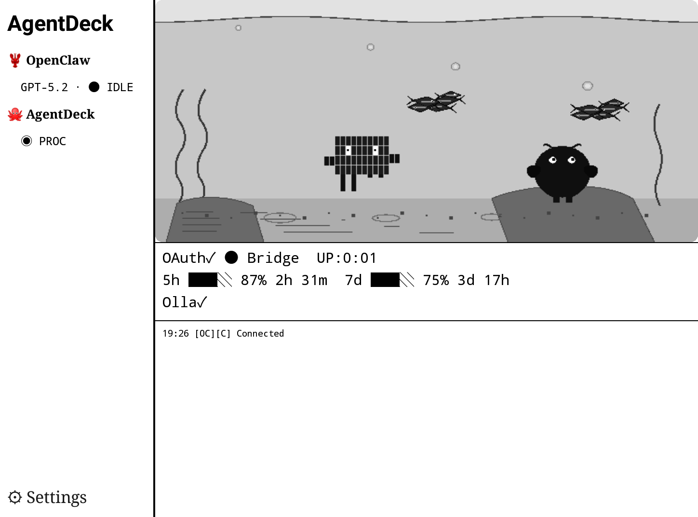

# AgentDeck

**Stop Chatting. Start Steering.**

AgentDeck turns your Elgato Stream Deck+ into a physical control surface for AI coding agents like Claude Code and OpenClaw.

> Control sessions. Interrupt runs. Switch modes. Monitor usage.
> Steer your AI — without leaving your keyboard flow.

<p align="center">
  
</p>

<p align="center">
  <a href="https://youtu.be/zVzrcaahdEs"><strong>Watch Demo on YouTube</strong></a>
</p>

<p align="center">
  <video src="docs/media/demo-clip.mp4" width="720" controls muted autoplay loop playsinline>
    <a href="docs/media/demo-clip.mp4">Watch demo clip</a>
  </video>
</p>

| | Requirement |
|---|---|
| **Platform** | macOS 14+ (Sonoma) — Windows/Linux not supported |
| **Hardware** | Elgato Stream Deck+ (8 keys, 4 encoders, LCD touch strip) |
| **Terminal** | iTerm2 (required for session management and voice paste) |
| **Android** | *(Optional)* Android 10+ tablet or e-ink reader for remote dashboard |

---

## Table of Contents

- [What is AgentDeck?](#what-is-agentdeck)
- [Prerequisites](#prerequisites)
- [Quick Start](#quick-start)
- [Manual Build & Install](#manual-build--install)
- [Usage](#usage)
- [Stream Deck+ Layout (v3)](#stream-deck-layout-v3)
- [Android Dashboard](#android-dashboard)
- [Configuration](#configuration)
- [Troubleshooting](#troubleshooting)
- [Uninstall](#uninstall)
- [Development](#development)
- [Roadmap](#roadmap)

### Documentation

- [Voice Setup](docs/voice-setup.md) — sox, whisper.cpp install, model selection
- [Stream Deck+ Layout Reference](docs/streamdeck-layout.md) — per-state layouts, encoder details, button colors
- [Android Reference](docs/android.md) — device support, build/signing, creature behavior
- [Protocol & Architecture](docs/protocol.md) — state machine, WebSocket messages, project structure

---

## What is AgentDeck?

AgentDeck is not a chat app, a plugin, or a shortcut collection.

It's a **control surface** — like an audio mixing console or a video color panel, but for AI coding agents. It reads your agent's state in real-time and dynamically reconfigures buttons and encoders to match what's happening right now.

| What it does | How |
|---|---|
| **Respond instantly** to permission prompts | YES / NO / ALWAYS buttons appear with semantic colors (green/red/blue) |
| **Interrupt** a runaway agent | STOP button sends Ctrl+C |
| **Switch modes** on the fly | Mode button cycles Plan / Accept Edits / Default |
| **Navigate options** physically | Encoder scrolls and selects multi-choice prompts; wide-canvas LCD shows all options |
| **Speak to your agent** | Push-to-talk voice → whisper.cpp transcription → auto-send. Works offline |
| **See suggestions** | Claude Code ghost text (autocomplete) appears on the Action encoder LCD |
| **Monitor usage** | Animated water-gauge dashboard with 5h / 7d / extra / session pages |
| **Run quick actions** | GO ON / REVIEW / COMMIT / CLEAR buttons; encoder cycles custom prompts |
| **Control system utilities** | Volume, mic, media playback, timer — all from the Utility encoder |
| **Manage terminal sessions** | iTerm dial switches sessions, auto-attaches detached tmux, auto-switches on tab focus |
| **Stay in flow** | Hardware augments your keyboard — never interrupts it |
| **Control from anywhere** | Commands work even when the terminal is in the background — no need to switch windows |

The bridge stays transparent: if it's off, Claude Code works exactly as before.

### Supported Agents

| Agent | Status |
|-------|--------|
| **Claude Code** | Supported (primary) |
| **OpenClaw** | Experimental — Gateway WebSocket, timeline panel, log stream |

### Supported Surfaces

| Surface | Status |
|---------|--------|
| **Stream Deck+** | Primary — 8 keys, 4 encoders, LCD touch strip |
| **Android Tablet** | Color terrarium + HUD overlay (60fps) |
| **Android E-ink** | B&W aquarium + partial refresh (A2/DU/FULL) |

### Architecture

```
Stream Deck Plugin ◄──── WebSocket ────► Bridge Server (Node.js, port 9120)
                                          ├── PTY Manager → claude CLI
User's Terminal ◄──── stdio proxy ──────► ├── Output Parser → State Machine
Claude Code Hooks ──── HTTP POST ──────► ├── Hook Server + SSE
                                          ├── WS Server → Plugin / Android
Android Dashboard ◄── WebSocket + mDNS ► └── Voice (whisper.cpp)
```

The bridge spawns Claude Code in a PTY, parses output + hook events into a state machine, and broadcasts state to all connected surfaces over WebSocket. Local clients are auto-trusted; LAN clients authenticate with a token from `~/.agentdeck/auth-token`. Both Stream Deck and Android can monitor and control the agent independently or simultaneously.

---

## Prerequisites

| Item | Required | Install |
|------|----------|---------|
| **macOS 14+** (Sonoma) | Yes | Windows/Linux not supported |
| **Node.js** >= 20 | Yes | `brew install node` |
| **pnpm** | Yes | `npm install -g pnpm` |
| **Elgato Stream Deck app** >= 6.7 | Yes | [Elgato Downloads](https://www.elgato.com/downloads) |
| **Stream Deck+ hardware** | Yes | 8 keys + 4 encoders + LCD touch strip |
| **iTerm2** | Yes | Terminal management, voice paste, session switching |
| **Claude Code CLI** | Yes | `npm install -g @anthropic-ai/claude-code` |
| **Stream Deck CLI** | Auto | Installed by `pnpm setup` if missing |
| **sox** (audio capture) | For voice | See [Voice Setup](docs/voice-setup.md) |
| **whisper.cpp** (transcription) | For voice | See [Voice Setup](docs/voice-setup.md) |

---

## Quick Start

```bash
# Option A: npm install (no clone needed)
npx @agentdeck/setup

# Option B: from source
git clone https://github.com/puritysb/AgentDeck.git && cd AgentDeck && pnpm setup
```

The `pnpm setup` command:
1. Checks required dependencies (Node.js 20+, pnpm, Claude CLI, Stream Deck app)
2. Installs `@elgato/cli` if missing
3. Runs `pnpm install` + `pnpm build`
4. Generates icon assets (16 PNGs)
5. Installs Claude Code hooks
6. Links the Stream Deck plugin
7. Links the `sdc` CLI globally
8. Checks optional dependencies (sox, whisper.cpp)

After setup, **restart the Stream Deck app**, then run:

```bash
sdc
```

You're steering.

---

## Manual Build & Install

### Build

```bash
cd AgentDeck
pnpm install
pnpm build            # shared → bridge, plugin, hooks
pnpm generate-icons   # SVG → PNG (required on first build)
```

### 1. Install Claude Code Hooks

```bash
node hooks/dist/install.js
```

Registers 7 hooks in `~/.claude/settings.local.json`: `SessionStart`, `SessionEnd`, `PreToolUse`, `PostToolUse`, `Stop`, `Notification`, `UserPromptSubmit`. Each hook POSTs JSON to the bridge. Remove with `node hooks/dist/install.js uninstall`.

### 2. Link Stream Deck Plugin

```bash
cd plugin && streamdeck link .sdPlugin
```

Creates a symlink in `~/Library/Application Support/com.elgato.StreamDeck/Plugins/`. **Restart the Stream Deck app** to load.

### 3. Link `sdc` CLI

```bash
cd bridge && pnpm link --global
```

### 4. Voice Setup (Optional)

Voice input requires **sox** (audio capture) and **whisper.cpp** (local transcription). Apple Silicon users must use arm64 Homebrew (`/opt/homebrew/`) for Metal GPU acceleration.

See **[Voice Setup Guide](docs/voice-setup.md)** for full instructions including architecture verification, model selection, and troubleshooting.

---

## Usage

### Start

```bash
sdc
```

This starts the bridge on port 9120 (HTTP + WebSocket), spawns Claude Code inside a PTY, and proxies your terminal transparently. Use Claude exactly as before — the Stream Deck adds a parallel control channel.

> **Security:** The bridge binds to `0.0.0.0` for LAN access (multi-surface monitoring). Local connections bypass authentication. Remote connections require the auth token from `~/.agentdeck/auth-token`.

### CLI Commands

```bash
sdc status           # check bridge/session state
sdc stop             # end session
sdc --port 9200      # custom port
sdc --command 'claude --model opus'  # custom Claude command
```

---

## Stream Deck+ Layout (v3)

<p align="center">
  
</p>

### Keypad — 8 Actions

```
┌────────┬─────────┬─────────┬───────────┐
│  MODE  │ SESSION │  USAGE  │  GO ON    │
├────────┼─────────┼─────────┼───────────┤
│ REVIEW │ COMMIT  │  CLEAR  │   STOP    │
└────────┴─────────┴─────────┘───────────┘
```

| Slot | Action | Description |
|------|--------|-------------|
| 0 | **Mode** | Toggle Default / Plan / Accept Edits |
| 1 | **Session** | Project name + state + session switch |
| 2 | **Usage** | Usage dashboard (5h / 7d / extra / session / models / oc-usage pages) |
| 3-6 | **Quick Action x4** | GO ON / REVIEW / COMMIT / CLEAR when idle — up to 4 options on permission/select prompt. 5+ options → 3 + MORE |
| 7 | **Stop** | Interrupt (Ctrl+C when processing) / Escape (when idle) |

### Encoders — 4 Slots

| Encoder | Action | Rotate | Push | Touch |
|---------|--------|--------|------|-------|
| E1 | **Utility** | Adjust value (volume, mic, timer) | Toggle / Action | Switch mode |
| E2 | **Action** | Scroll options / cycle prompts | Send prompt / Confirm | Same as push |
| E3 | **Terminal** | Switch iTerm session | Activate / Attach tmux | — |
| E4 | **Voice** | Scroll transcription text | Hold = record, tap (<500ms) = cancel | — |

<p align="center">
  
  &nbsp;&nbsp;
  
</p>
<p align="center"><em>Left: Voice transcription (Korean) on wide-canvas LCD &nbsp;|&nbsp; Right: Model selection with encoder option list</em></p>

### Dynamic Button States

Slots 3-6 reconfigure based on agent state — permission prompts get semantic colors (green=approve, red=deny, blue=permanent), options get teal/green, and 5+ options collapse into encoder wide-canvas mode.

<p align="center">
  
</p>

See **[Stream Deck+ Layout Reference](docs/streamdeck-layout.md)** for per-state ASCII diagrams, color tables, encoder details, and button label intelligence.

---

## Android Dashboard

Monitor and control your AI agents from any Android device — no Stream Deck required.

<p align="center">
  
  &nbsp;&nbsp;
  
</p>
<p align="center"><em>Left: Tablet mode (color terrarium + HUD) &nbsp;|&nbsp; Right: E-ink mode (Crema S, B&W aquarium)</em></p>

The Android app connects to the same bridge server over your local network, giving you a second screen for agent monitoring and a full mirror of the Stream Deck controls.

### Two Display Modes

**E-ink mode** (Crema S, Onyx, Kobo)
- Aquarium-centered B&W dashboard — pixel art creatures in a 16-level grayscale terrarium
- Partial refresh zones: A2 (200ms) for fast UI, DU for status, FULL (500ms) for the aquarium
- Left panel (22%): agent list with state indicators
- Right panel (78%): aquarium + rate limits/models + event timeline

**Tablet mode** (Lenovo, general Android tablets)
- Full-color terrarium background with 60fps creature animation
- Semi-transparent HUD panels overlay agent status, rate limits, timeline
- Identical information to e-ink, expressed through color and motion

### Displayed Information

- **Agent status**: type, session name, model, state (IDLE / PROCESSING / AWAITING)
- **Rate limits**: 5h and 7d usage gauges with reset countdown timers
- **Models**: OAuth-connected models + locally running Ollama models
- **Event timeline**: tool calls, model calls, state changes — timestamped log
- **Connection**: bridge status, billing type, uptime
- **Gateway health**: OpenClaw doctor warnings/errors — crayfish creature visually reflects system health

### Three-Tab Navigation

| Tab | Content |
|-----|---------|
| **Dashboard** | Terrarium background + HUD overlay panels. Connection overlay when disconnected (mDNS discovery, QR pairing) |
| **Deck** | Full Stream Deck+ mirror — 4 encoder panels (swipe/tap/long-press gestures) + 2x4 button grid with context area |
| **Settings** | Bridge connection, display preferences |

### Connect to Bridge

The app finds your bridge automatically:

1. **mDNS** — the bridge advertises `_agentdeck._tcp` on your local network; the app discovers it within seconds
2. **QR pairing** — run `sdc qr` on your Mac, scan with the app's camera (CameraX + ML Kit)
3. **Manual** — enter the bridge IP and port in Settings

Once connected, the app receives real-time state updates over WebSocket and can send commands back to the bridge.

See **[Android Reference](docs/android.md)** for device support, build/signing instructions, and creature behavior details.

---

## Project Structure

```
AgentDeck/
├── shared/        # Shared TypeScript types (states, protocol, voice paths)
├── bridge/        # Node.js bridge server (PTY, hooks, WS, voice, adapters)
├── plugin/        # Stream Deck SDK v2 plugin (actions, renderers, utility modes)
├── hooks/         # Claude Code hook installer
├── setup/         # npm setup package (@agentdeck/setup)
├── android/       # Jetpack Compose dashboard (e-ink + tablet, terrarium, deck mirror)
├── config/        # Prompt templates + default settings
├── scripts/       # Install, uninstall, package, icon generation
└── docs/          # Documentation (voice, layout, android, protocol)
```

See **[Protocol & Architecture](docs/protocol.md)** for the full file tree, state machine diagram, and WebSocket message reference.

---

## Configuration

### Quick Action Buttons

The four Quick Action buttons (slots 3-6) are configurable via the Stream Deck Property Inspector. Defaults:

| Slot | Label | Action |
|------|-------|--------|
| 3 | GO ON | `continue` (sends prompt to continue) |
| 4 | REVIEW | `/review` |
| 5 | COMMIT | `/commit` |
| 6 | CLEAR | `/clear` |

Slot 3 also shows **START** when disconnected (spawns a new `sdc` session).

### Prompt Templates

Edit `config/prompt-templates.json` to customize the prompts cycled by the **Action encoder** (E2) rotate:

```json
{
  "templates": [
    { "label": "Fix Bug", "prompt": "Please fix the bug described above" },
    { "label": "Test", "prompt": "Write tests for the changes made" },
    { "label": "Review", "prompt": "Review the code for issues and suggest improvements" },
    { "label": "Explain", "prompt": "Explain how this code works step by step" }
  ]
}
```

---

## Troubleshooting

| Symptom | Cause | Fix |
|---------|-------|-----|
| Plugin shows DISCONNECTED | Bridge not running | Run `sdc` |
| Plugin reconnects every 3s | Bridge crashed | Restart `sdc` |
| Bridge enters disconnected state | Claude process exited | Restart `sdc` |
| State tracking not working | Hook server unreachable | Verify `sdc` is running |
| Stream Deck buttons inactive | Hardware not connected | Reconnect + restart app |
| Stuck in PROCESSING > 5 min | Agent stalled | STOP button or Ctrl+C in terminal |
| "Is sox installed?" | sox missing | See [Voice Setup](docs/voice-setup.md) |
| "Is whisper.cpp installed?" | whisper.cpp missing | See [Voice Setup](docs/voice-setup.md) |
| Voice transcription very slow / timeout | x86 whisper-cli (no Metal GPU) | Install arm64 Homebrew + whisper-cpp. See [Voice Setup](docs/voice-setup.md) |
| `whisper-cli: arm64=false, metal=false` | Using x86 binary through Rosetta | Install arm64 Homebrew at `/opt/homebrew/` |
| Plugin not in Stream Deck app | Plugin not linked | Restart Stream Deck app, then `cd plugin && streamdeck link .sdPlugin` |
| Hooks not firing | Hooks not installed or stale | `node hooks/dist/install.js` (re-installs all 7 hooks) |
| Need to remove hooks | Uninstalling AgentDeck | `node hooks/dist/install.js uninstall` |
| Plugin loads but buttons blank | Plugin needs rebuild | `pnpm build && pnpm generate-icons`, restart Stream Deck app |
| Android app can't find bridge | mDNS blocked on network | Use QR pairing (`sdc qr`) or enter IP manually in Settings |
| Android shows "Not Connected" | Bridge not reachable | Verify same LAN; for USB: `adb reverse tcp:9120 tcp:9120` then connect to 127.0.0.1:9120 |
| E-ink ghosting on Crema | Missing full GC16 refresh | State transitions trigger full refresh automatically; force refresh by toggling bridge connection |

### tmux -CC Compatibility

When using iTerm2's `tmux -CC` (control mode): run `sdc` inside a tmux window. The bridge manages its own PTY, so there's no conflict.

Signal chain: `tmux → iTerm2 → sdc → bridge PTY → claude`

---

## Uninstall

```bash
bash scripts/uninstall.sh
```

Removes Claude Code hooks, unlinks `sdc` CLI, and removes the Stream Deck plugin symlink. **Restart the Stream Deck app** afterward.

---

## Development

```bash
pnpm -r --parallel dev    # Watch mode for all packages
cd plugin && pnpm build   # Rebuild plugin only
cd bridge && pnpm build   # Rebuild bridge only
pnpm -r typecheck         # Type check without building
```

### Testing

```bash
pnpm test                 # Run all tests (vitest)
pnpm test -- --watch      # Watch mode
```

Tests cover output parsing, state machine transitions, hook installation, option rendering, and text utilities. Quick smoke test after changes:

```bash
pnpm build && pnpm test && sdc status
```

### Packaging

Build a distributable `.streamDeckPlugin` file:

```bash
pnpm package    # → dist/bound.serendipity.agentdeck.streamDeckPlugin
```

Recipients double-click to install. The bridge (`sdc`) and Claude Code CLI must be installed separately.

Published npm packages: `@agentdeck/shared`, `@agentdeck/bridge`, `@agentdeck/setup`.

### Debugging

Bridge logs print to the `sdc` terminal:
```
[sdc] Starting AgentDeck bridge on port 9120...
[sdc] Hook server listening on port 9120
[sdc] WebSocket server ready on port 9120
[sdc] Spawned: claude
[WsServer] Plugin connected
[StateMachine] DISCONNECTED -> idle (trigger: session_start, source: hook)
```

Stream Deck plugin logs: Stream Deck app → Settings → Logs.

---

## Roadmap

- Project-specific layout presets
- Custom button icon support
- Windows/Linux platform support
- Additional agent integrations (Opencode, Codex CLI)

---

<p align="center">
<strong>AgentDeck</strong> — Physical Control Surface for AI Coding Agents
</p>
